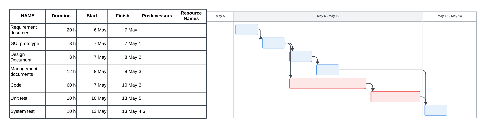

# Project Estimation - CURRENT
Date: 2024-05-05

Version: 1.0

# Estimation approach
Consider the EZElectronics  project in CURRENT version (as given by the teachers), assume that you are going to develop the project INDEPENDENT of the deadlines of the course, and from scratch
# Estimate by size
### 
|                                                                                                         | Estimate                       |             
|---------------------------------------------------------------------------------------------------------|--------------------------------|  
| NC =  Estimated number of classes to be developed                                                       | 3                              |             
| A = Estimated average size per class, in LOC                                                            | 200                            | 
| S = Estimated size of project, in LOC (= NC * A)                                                        | 600                            |
| E = Estimated effort, in person hours (here use productivity 10 LOC per person hour)                    | 60 h                           |   
| C = Estimated cost, in euro (here use 1 person hour cost = 30 euro)                                     | 1800 euros                     | 
| Estimated calendar time, in calendar weeks (Assume team of 4 people, 8 hours per day, 5 days per week ) | around half week (0,375 weeks) |               

# Estimate by product decomposition
### 
| component name       | Estimated effort (person hours) |             
|----------------------|---------------------------------| 
| requirement document | 20 h                            |
| GUI prototype        | 8 h                             |
| design document      | 8 h                             |
| code                 | 60 h                            |
| unit tests           | 10 h                            |
| api tests            | 10 h                            |
| management documents | 12 h                            |

# Estimate by activity decomposition
### 
| Activity name        | Estimated effort (person hours) |             
|----------------------|---------------------------------|
| requirement document | 20 h                            |
| GUI prototype        | 8 h                             |
| design document      | 8 h                             |
| management documents | 12 h                            |
| code                 | 60 h                            |
| unit tests           | 10 h                            |
| api tests            | 10 h                            |

###

# Summary

The first approach, estimate by size, is the most simple and quick way to estimate the project. It is based on the number of classes and the average size of each class. This approach is not very accurate because it considers just the code, although it gives a rough estimate of the project. The estimated effort is 60 hours, and the estimated duration is 0.375 weeks.

Another approach is the estimate by product decomposition. This approach is more detailed and considers the different components of the project. The estimated effort is 128 hours, and the estimated duration is 0.8 weeks.

The last approach is the estimate by activity decomposition. This approach is the most detailed and considers the different activities of the project. The estimated effort is 128 hours, and the estimated duration is 1.2 weeks.
In this case, all activities are estimated to be done by 4 people, but when the activities are done in parallel, is considered that the team is working on the different activities. In particular, design documents and management documents are done in parallel with the code, each by a couple of people.

In conclusion, the estimate by activity decomposition is the most accurate, but it is also the most time-consuming. The estimate by product decomposition is a good compromise between accuracy and time, while the estimate by size is the quickest but the least accurate.

|                                    | Estimated effort | Estimated duration |          
|------------------------------------|------------------|--------------------|
| estimate by size                   | 60h              | 0,375 weeks        |
| estimate by product decomposition  | 128 h            | 0,8 weeks          |
| estimate by activity decomposition | 128 h            | 1,2 weeks          |

