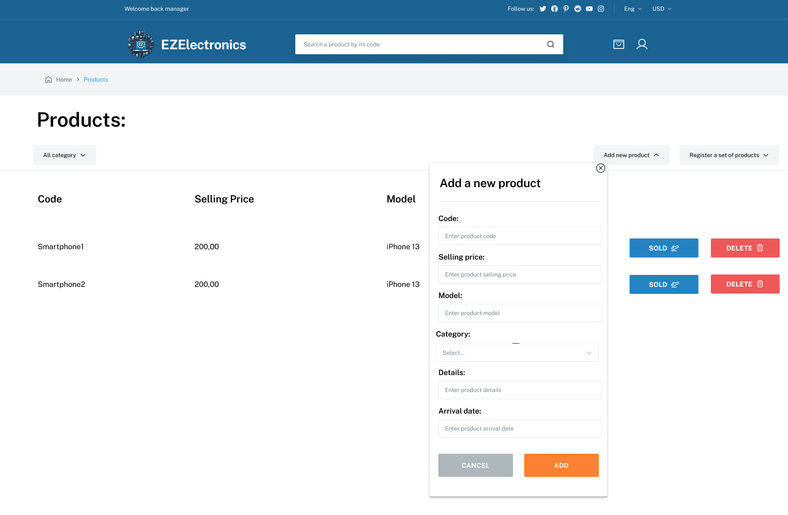
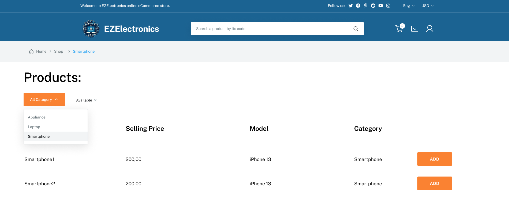
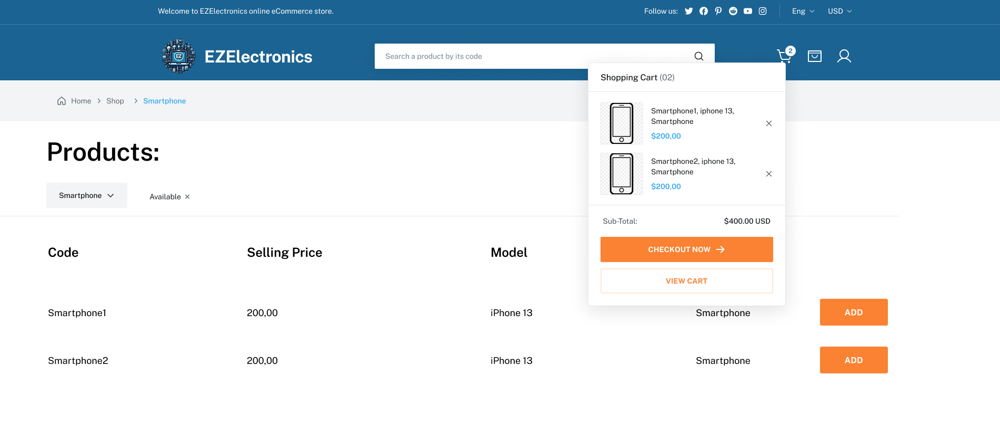

# Graphical User Interface Prototype - CURRENT

Authors: [EZMIRON DENIKU](mailto:s333461@studenti.polito.it), [SEBASTIAN MONTOYA ZULUAGA](mailto:s328735@studenti.polito.it), [MARCO PIASSO](mailto:s329131@studenti.polito.it), [JUNAID SHAH](mailto:s289642@studenti.polito.it)

Date: 2024-05-05

Version: 1.0

### Use Case 1: Register Product

### Use Case 2: Add a set of products

### Use Case 3, 4: Manager view:
From the manager view, the manager can view the products, mark products as sold or delete them.

### Use Case 5, : Browse Products

### Use Case 6, 8, 9: View Cart, Remove Product, Checkout

### Use Case 7: Add Product

### Use Case 10: History of Purchases

### Use Case 11: Sign Up

### Use Case 12: Sign In

### Use Case 13, 14: Logout/View Profile

