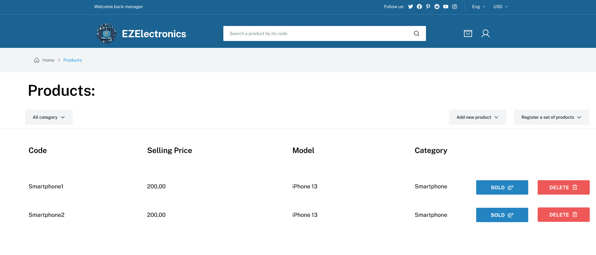

# Graphical User Interface Prototype - FUTURE

Authors: [EZMIRON DENIKU](mailto:s333461@studenti.polito.it), [SEBASTIAN MONTOYA ZULUAGA](mailto:s328735@studenti.polito.it), [MARCO PIASSO](mailto:s329131@studenti.polito.it), [JUNAID SHAH](mailto:s289642@studenti.polito.it)

Date: 2024-05-05

Version: 1.0

\<Report here the GUI that you propose for EZElectronics in FUTURE form, as proposed by the team. You are free to organize it as you prefer. A suggested presentation matches the Use cases and scenarios defined in the Requirement document. The GUI can be shown as a sequence of graphical files (jpg, png) >

### Use Case 1: Register Product

### Use Case 2: Add a set of products

### Use Case 3, 4: Manager view:
From the manager view, the manager can view the products, mark products as sold or delete them.

### Use Case 5, : Browse Products

### Use Case 6, 8, 9: View Cart, Remove Product, Checkout

### Use Case 6, 9: Sign in to buy cart

### Use Case 7: Add Product

### Use Case 10: Category discount

### Use Case 11: Sign Up

### Use Case 12: Sign In

### Use Case 13, 14: Logout/View Profile

### Use Case 15: Repairs

### Use Case 16: Product review

### Use Case 18: Returns

### Use Case 19: Repairs

