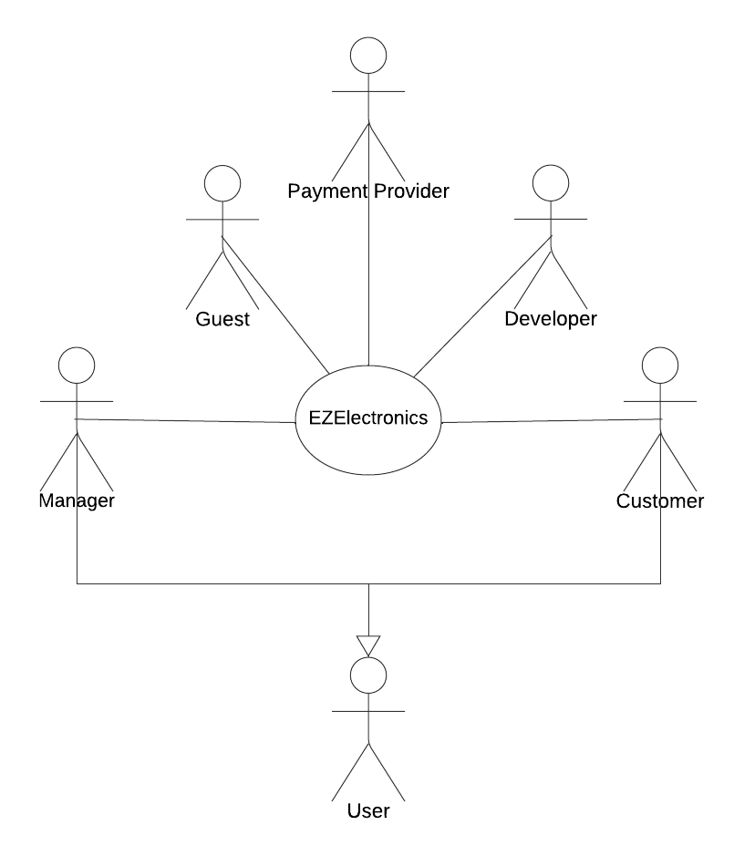
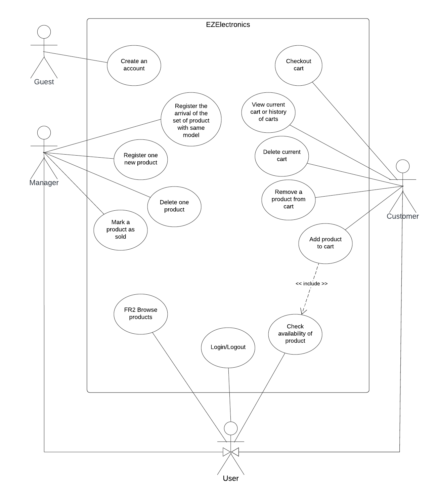
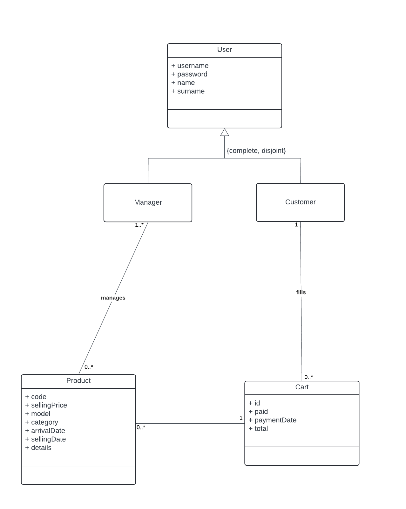
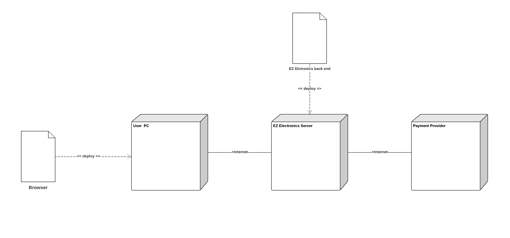

# Requirements Document - current EZElectronics

Date: 2024-05-5

Version: V1 - description of EZElectronics in CURRENT form (as received by teachers)

| Version number |                                                       Change                                                       |
|:--------------:|:------------------------------------------------------------------------------------------------------------------:|
|     1.0.0      |   Add use cases with scenarios, non functional requirements, updated functional requirements and context diagram   |
|     0.1.0      |                                            Add use cases with scenarios                                            |
|     0.0.5      |                                          Add non functional requirements                                           |                                                                                                                  
|     0.0.4      |                                Updated functional requirements and context diagram                                 | 
|     0.0.3      |                                              Add class diagram draft                                               |
|     0.0.2      |                           Add guest stakeholder, and add context and use cases diagrams                            |
|     0.0.1      | Add manger, customer, developer, supplier, payment provider   and draft interfaces and functional requirements |

# Contents

- [Requirements Document - current EZElectronics](#requirements-document---current-ezelectronics)
- [Contents](#contents)
- [Informal description](#informal-description)
- [Stakeholders](#stakeholders)
- [Context Diagram and interfaces](#context-diagram-and-interfaces)
    - [Context Diagram](#context-diagram)
    - [Interfaces](#interfaces)
- [Stories and personas](#stories-and-personas)
- [Functional and non functional requirements](#functional-and-non-functional-requirements)
    - [Functional Requirements](#functional-requirements)
    - [Non Functional Requirements](#non-functional-requirements)
- [Use case diagram and use cases](#use-case-diagram-and-use-cases)
    - [Use case diagram](#use-case-diagram)
        - [Use case 1, UC1](#use-case-1-uc1)
            - [Scenario 1.1](#scenario-1-1)
            - [Scenario 1.2](#scenario-1-2)
            - [Scenario 1.3](#scenario-1-3)
        - [Use case 2, UC2](#use-case-2-uc2)
            - [Scenario 2.1](#scenario-2-1)
            - [Scenario 2.2](#scenario-2-2)
        - [Use case 3, UC3](#use-case-3-uc3)
            - [Scenario 3.1](#scenario-3-1)
            - [Scenario 3.2](#scenario-3-2)
            - [Scenario 3.3](#scenario-3-3)
        - [Use case 4, UC4](#use-case-4-uc4)
            - [Scenario 4.1](#scenario-4-1)
            - [Scenario 4.2](#scenario-4-2)
        - [Use case 5, UC5](#use-case-5-uc5)
            - [Scenario 4.2](#scenario-4-2)
            - [Scenario 4.2](#scenario-4-2)
            - [Scenario 4.2](#scenario-4-2)
            - [Scenario 4.2](#scenario-4-2)
        - [Use case 6, UC6](#use-case-6-uc6)
            - [Scenario 5.1](#scenario-5-1)
            - [Scenario 5.2](#scenario-5-2)
            - [Scenario 5.3](#scenario-5-3)
        - [Use case 7, UC7](#use-case-7-uc7)
            - [Scenario 7.1](#scenario-7-1)
            - [Scenario 7.2](#scenario-7-2)
            - [Scenario 7.3](#scenario-7-3)
            - [Scenario 7.4](#scenario-7-4)
        - [Use case 8, UC8](#use-case-8-uc8)
            - [Scenario 8.1](#scenario-8-1)
            - [Scenario 8.2](#scenario-8-2)
            - [Scenario 8.3](#scenario-8-3)
        - [Use case 9, UC9](#use-case-9-uc9)
            - [Scenario 9.1](#scenario-9-1)
            - [Scenario 9.2](#scenario-9-2)
        - [Use case 10, UC10](#use-case-10-uc10)
            - [Scenario 10.1](#scenario-10-1)
            - [Scenario 10.2](#scenario-10-2)
        - [Use case 11, UC11](#use-case-11-uc11)
            - [Scenario 11.1](#scenario-11-1)
            - [Scenario 11.2](#scenario-11-2)
            - [Scenario 11.3](#scenario-11-3)
            - [Scenario 11.4](#scenario-11-4)
        - [Use case 12, UC12](#use-case-12-uc12)
            - [Scenario 12.1](#scenario-12-1)
            - [Scenario 12.2](#scenario-12-2)
        - [Use case 13, UC13](#use-case-13-uc13)
            - [Scenario 13.1](#scenario-13-1)
            - [Scenario 13.2](#scenario-13-2)
        - [Use case 14, UC14](#use-case-14-uc14)
            - [Scenario 14.1](#scenario-14-1)
            - [Scenario 14.2](#scenario-14-2)
- [Glossary](#glossary)
- [System Design](#system-design)
- [Deployment Diagram](#deployment-diagram)

# Informal description

EZElectronics (read EaSy Electronics) is a software application designed to help managers of electronics stores to
manage their products and offer them to customers through a dedicated website. Managers can assess the available
products, record new ones, and confirm purchases. Customers can see available products, add them to a cart and see the
history of their past purchases.

# Stakeholders

| Stakeholder name |           Description            |
|:----------------:|:--------------------------------:|
|   User Manager   |  manages the electronics store   |
|  User Customer   |    buys electronics products     |  
|      Guest       | visits the site for registration |
|    Developer     |    develops the EZElectronics    |
|     Supplier     |     supplies the electronics     |
| Payment Provider |    provides payment services     |

# Context Diagram and interfaces

## Context Diagram

 

 

## Interfaces

 

|      Actor       | Logical Interface | Physical Interface |
|:----------------:|:-----------------:|:------------------:|
|     Manager      |        GUI        |         PC         |
|     Customer     |        GUI        |         PC         |
|      Guest       |        GUI        |         PC         |
|    Developer     |     GUI, API      |         PC         |
| Payment Provider |        API        |      internet      |

# Stories and personas

### User Stories

1. As a **Customer**, I want to be able to browse all available electronics products, so that I can choose the ones I
   want to buy.
2. As a **Customer**, I want to be able to add products to my cart, so that I can review them before purchasing.
3. As a **Customer**, I want to be able to view my cart, so that I can see what I've added and the total cost.
4. As a **Customer**, I want to be able to remove products from my cart, so that I can change my mind before purchasing.
5. As a **Customer**, I want to be able to checkout my cart, so that I can complete my purchase.
6. As a **Manager**, I want to be able to add new products to the store, so that customers can buy them.
7. As a **Manager**, I want to be able to mark products as sold, so that they are no longer available for purchase.
8. As a **Guest**, I want to be able to register for an account, so that I can become a customer or a manager.

### Personas

1. **Persona: Francesca, the Customer**

- Age: 30
- Occupation: Software Engineer
- Description: Francesca is a tech enthusiast who loves to keep up with the latest electronics. She prefers to shop online
  for convenience and often buys new gadgets as soon as they are released.

2. **Persona: Gino, the Manager**

- Age: 45
- Occupation: Store Manager
- Description: Gino has been managing electronics stores for over 20 years. He is comfortable with technology and uses
  the EZElectronics software to manage his store's inventory and sales.

3. **Persona: Carletto, the Guest**

- Age: 25
- Occupation: Student
- Description: Carletto is a student who is looking to buy a new laptop for his studies. He visits the EZElectronics
  website to browse the available products and register for an account.

4. **Persona: Mario, the Customer**

- Age: 35
- Occupation: Sales Manager
- Description: Mario is a busy professional who needs to buy electronics for his team. He uses the EZElectronics website
  to quickly add products to his cart and checkout.

5. **Persona: Sara, the Manager**

- Age: 40
- Occupation: Business Owner
- Description: Sara is a small business owner who runs an electronics store. She uses the EZElectronics software to
  manage her store's inventory, sales, and customer transactions.

 

# Functional and non functional requirements

## Functional Requirements

 

|  ID   |                                     Description                                      |
|:-----:|:------------------------------------------------------------------------------------:|
|  FR1  |                         Manage products of electronics store                         |
| FR1.0 |                               Register one new product                               |
| FR1.1 |                     Register the arrival of new set of products                      |
| FR1.2 |                                Mark a product as sold                                |
| FR1.3 |                                  Delete one product                                  |
|  FR2  |                                   Browse products                                    |
| FR2.1 | View all products in the store, with possibility of filtering available or sold ones |
| FR2.2 |                      Search for a specific product by its code                       |
| FR2.3 |                  View all products of a specific category or model                   |
|  FR3  |                              Manage customer purchases                               |
| FR3.0 |                 Add or remove a product from the cart of a customer                  |
| FR3.1 |                                  Checkout the cart                                   |
| FR3.2 |                                  View current cart                                   |
| FR3.3 |               View the history of all purchases of a specific customer               |
| FR3.4 |                                 Delete current cart                                  |
|  FR4  |                                 Manage user accounts                                 |
| FR4.0 |                  Register a new account as a customer or a manager                   |
| FR4.1 |               Authenticate a user with a username and password (Login)               |
| FR4.2 |                                     Logout user                                      |
| FR4.3 |                    Authorize a user to perform a specific action                     |

[//]: # (|  FR5  |             Testing functionalities of the EZElectronics system              |)

[//]: # (| FR5.0 |                Delete all products or carts or user accounts                 |)

[//]: # (| FR5.1 |                     Delete user account by its username                      |)

[//]: # (| FR5.2 | View the list of all users in the system,   filtered by role or username |)

## Non Functional Requirements

 

|   ID    | Type (efficiency, reliability, ..) |                                      Description                                       |     Refers to     |
|:-------:|:----------------------------------:|:--------------------------------------------------------------------------------------:|:-----------------:|
|  NFR1   |             Usability              |        A user manager should be taught to use the software properly in 2 hours         |        FR1        |
|  NFR2   |             Usability              |                A user should learn how to browse products in 15 minutes                |      FR2/FR3      |
|  NFR3   |             Usability              |      The proccess of registration of a guest should be done at most in 5 minutes       |       FR4.0       |
|  NFR4   |             Efficiency             |                   All users response time should be less than 1 sec                    | FR1/FR2, FR3, FR4 |
|  NFR5   |            Reliability             | An available product can be mark as out of stock at most once per year, and vice versa |       FR2.1       |
|  NFR6   |            Reliability             | It should have a robust error handling to prevent data loss and ensure data integrity  |   FR1, FR3, FR4   |
|  NFR7   |            Reliability             |                      The server must be online at 95% of the day                       |                   |
|  NFR8   |          Maintainability           |  The amount of time per week spent on fixing bugs has to be less than 4 person hours   |                   |
|  NFR9   |          Maintainability           | Integration of new features with the code base should require less than 2 person hours |                   |
|  NFR10  |              Security              |                        All passwords of users must be encrypted                        |                   |
|  NF11   |              Security              |          Permissions of different user should be manage by design and default          |                   |

# Use case diagram and use cases

## Use case diagram

 

 

### Use case 1, UC1

| Actors Involved  |                               Manager                               |
|:----------------:|:-------------------------------------------------------------------:|
|   Precondition   |                      New unregistered product                       |
|  Post condition  |                 new registered product in the store                 |
| Nominal Scenario | The system asks for product parameters and a new product is created |
|     Variants     |                                None                                 |
|    Exceptions    |            Product already exists or invalid parameters             |

 

#### Scenarios

|  Scenario 1.1  | Manager wants to register a new product |
|:--------------:|:---------------------------------------:|
|  Precondition  | Manager wants to register a new product |
| Post condition |  new product registered in the system   |

| Step# | System                                                         | User                                                |
|-------|----------------------------------------------------------------|-----------------------------------------------------|
| 1     |                                                                | A manager wishes to register a new product          |
| 2     | Ask for code, price, model, category, details and arrival date |                                                     |
| 3     |                                                                | The manager inserts all of the parameters specified |
| 4     | Check if parameters are within the constraints                 |                                                     |
| 5     | The system registers the new product                           |                                                     |

 
 

|  Scenario 1.2  | Manager wants to register a duplicate product |
|:--------------:|:---------------------------------------------:|
|  Precondition  |    Manager wants to register a new product    |
| Post condition |  Manager prompted to check the product code   |

| Step# | System                                                         | User                                                                                  |
|-------|----------------------------------------------------------------|---------------------------------------------------------------------------------------|
| 1     |                                                                | A manager wishes to register a new product                                            |
| 2     | Ask for code, price, model, category, details and arrival date |                                                                                       |
| 3     |                                                                | The manager inserts all of the parameters specified but with an already existing code |
| 4     | Check if parameters are within the constraints                 |                                                                                       |
| 5     | The system prompts the manager to check the code               |                                                                                       |

 
 

|  Scenario 1.3  | Manager wants to register a new product with the wrong arrival date |
|:--------------:|:-------------------------------------------------------------------:|
|  Precondition  |               Manager wants to register a new product               |
| Post condition |     Manager prompted to double check the arrival Date inserted      |

| Step# | System                                                          | User                                                                                            |
|-------|-----------------------------------------------------------------|-------------------------------------------------------------------------------------------------|
| 1     |                                                                 | A manager wishes to register a new product                                                      |
| 2     | Ask for code, price, model, category, details and arrival date  |                                                                                                 |
| 3     |                                                                 | The manager inserts all of the parameters specified with an arrival date after the current date |                                        
| 4     | Check if parameters are within the constraints                  |                                                                                                 |
| 5     | The system prompts the manager to double check the arrival date |                                                                                                 |

 
 

### Use case 2, UC2

| Actors Involved  |                             Manager                              |
|:----------------:|:----------------------------------------------------------------:|
|   Precondition   |           arrival of registered product for inventory            |
|  Post condition  |                     updated product quantity                     |
| Nominal Scenario | The system asks for quantity to add and the inventory is updated |
|     Variants     |                               None                               |
|    Exceptions    |                        invalid parameters                        |

 

#### Scenarios

|  Scenario 2.1  | Manager wants to update product quantity |
|:--------------:|:----------------------------------------:|
|  Precondition  | Manager wants to update product quantity |
| Post condition |         updated product quantity         |

| Step# | System                                                   | User                                                |
|-------|----------------------------------------------------------|-----------------------------------------------------|
| 1     |                                                          | A manager wishes to add product quantity            |
| 2     | Ask for price, model, category, details and arrival date |                                                     |
| 3     |                                                          | The manager inserts all of the parameters specified |
| 4     | Check if parameters are within the constraints           |                                                     |
| 5     | The system registers the new product                     |                                                     |

 
 

|  Scenario 2.2  | Manager wants to update product quantity with arrival date after the current date |
|:--------------:|:---------------------------------------------------------------------------------:|
|  Precondition  |       Manager wants to update product quantity with date after current date       |
| Post condition |                       prompts manager to check arrival Date                       |

| Step# | System                                                   | User                                                                     |
|-------|----------------------------------------------------------|--------------------------------------------------------------------------|
| 1     |                                                          | A manager wishes to add product quantity                                 |
| 2     | Ask for price, model, category, details and arrival date |                                                                          |
| 3     |                                                          | The manager inserts all of the parameters specified (date after current) |
| 4     | Check if parameters are within the constraints           |                                                                          |
| 5     | The system prompts the manager to check the arrival Date |                                                                          |

 
 

### Use case 3, UC3

| Actors Involved  |                 Manager                 |
|:----------------:|:---------------------------------------:|
|   Precondition   |    a product sale is about to occur     |
|  Post condition  | product is marked as sold in the system |
| Nominal Scenario |    Manager marks the product as sold    |
|     Variants     |                  None                   |
|    Exceptions    |           invalid parameters            |

 

#### Scenarios

|  Scenario 3.1  | Manager wants to mark product as sold |
|:--------------:|:-------------------------------------:|
|  Precondition  |  Manager wants mark product as sold   |
| Post condition |        product marked as sold         |

| Step# | System                                         | User                                                |
|-------|------------------------------------------------|-----------------------------------------------------|
| 1     |                                                | A manager wishes to mark product as sold            |
| 2     | Ask for code and selling date                  |                                                     |
| 3     |                                                | The manager inserts all of the parameters specified |
| 4     | Check if parameters are within the constraints |                                                     |
| 5     | The system marks the product as sold           |                                                     |

 
 

|  Scenario 3.2  | Manager wants to mark product as sold but the code does not exist |
|:--------------:|:----------------------------------------------------------------:|
|  Precondition  |                Manager wants mark product as sold                |
| Post condition |                      The product is not marked as sold because the code does not exist |

| Step# | System                                                    | User                                                |
|-------|-----------------------------------------------------------|-----------------------------------------------------|
| 1     |                                                           | A manager wishes to mark product as sold            |
| 2     | Ask for code and selling date                             |                                                     |
| 3     |                                                           | The manager inserts all of the parameters specified |
| 4     | Check if parameters are within the constraints            |                                                     |
| 5     | The system suggests the manager to check the product code |                                                     |a id="scenario-3-2"></a>

 
 

|  Scenario 3.3  | Manager wants to mark product as sold but it is already sold |
|:--------------:|:------------------------------------------------------------:|
|  Precondition  |              Manager wants mark product as sold              |
| Post condition | The product is not marked as sold because it is already sold |

| Step# | System                                         | User                                                |
|-------|------------------------------------------------|-----------------------------------------------------|
| 1     |                                                | A manager wishes to mark product as sold            |
| 2     | Ask for code and selling date                  |                                                     |
| 3     |                                                | The manager inserts all of the parameters specified |
| 4     | Check if parameters are within the constraints |                                                     |
| 5     | The system tells the product is already sold   |                                                     |

 
 

### Use case 4, UC4

| Actors Involved  |                               Manager                               |
|:----------------:|:-------------------------------------------------------------------:|
|   Precondition   |                      a product must be deleted                      |
|  Post condition  |                   product deleted from the system                   |
| Nominal Scenario | The system asks for the product code and deletes it from the system |
|     Variants     |                                None                                 |
|    Exceptions    |                         invalid parameters                          |

 

#### Scenarios

|  Scenario 4.1  |  Manager wants to delete product  |
|:--------------:|:---------------------------------:|
|  Precondition  | Manager wants to delete a product |
| Post condition |    product deleted from system    |

| Step# | System                         | User                                           |
|-------|--------------------------------|------------------------------------------------|
| 1     |                                | A manager wishes to delete a product           |
| 2     | Ask for product code           |                                                |
| 3     |                                | The manager inserts the product code to delete |
| 4     | Check if code exists           |                                                |
| 5     | The system deletes the product |                                                |

 
 

|  Scenario 4.2  |   Manager wants to delete product with the wrong code    |
|:--------------:|:--------------------------------------------------------:|
|  Precondition  | Manager wants to delete a product but has the wrong code |
| Post condition |        prompts manager to check the product code         |

| Step# | System                                                   | User                                           |
|-------|----------------------------------------------------------|------------------------------------------------|
| 1     |                                                          | A manager wishes to delete a product           |
| 2     | Ask for product code                                     |                                                |
| 3     |                                                          | The manager inserts the product code to delete |
| 4     | Check if code exists                                     |                                                |
| 5     | The system prompts the manager to check the product code |                                                |

 
 

### Use case 5, UC5

| Actors Involved  |                                      User                                       |
|:----------------:|:-------------------------------------------------------------------------------:|
|   Precondition   | A logged in user wants to know all the products of a specific category or model |
|  Post condition  |                                  Product shown                                  |
| Nominal Scenario |        The system shows all the products which satisfy the requirements         |
|     Variants     |                    User wants to see only the sold products                     |
|    Exceptions    |                                  Server error                                   |

 

#### Scenarios

|  Scenario 5.1  |        User wants to see all the products of a specific category         |
|:--------------:|:------------------------------------------------------------------------:|
|  Precondition  | A logged in user wants to see some products based on a specific category |
| Post condition |                              Products shown                              |

| Step# | System                                                                              | User                                                        |
|-------|-------------------------------------------------------------------------------------|-------------------------------------------------------------|
| 1     |                                                                                     | A user is logged in and wants to browse some products       |
| 2     | Asks for the category and if the user want to see only sold products or yet to sell |                                                             |
| 3     |                                                                                     | The user inserts the category and the status of the product |
| 4     | Browses all the products which satisfy the requests                                 |                                                             |
| 5     | If any product is found, show it                                                    |                                                             |
| 6     |                                                                                     | All the required products are on screen                     |

 
 

|  Scenario 5.2  |        User wants to see all the products of a specific model         |
|:--------------:|:---------------------------------------------------------------------:|
|  Precondition  | A logged in user wants to see some products based on a specific model |
| Post condition |                            Products shown                             |

| Step# | System                                                                           | User                                                     |
|-------|----------------------------------------------------------------------------------|----------------------------------------------------------|
| 1     |                                                                                  | A user is logged in and wants to browse some products    |
| 2     | Asks for the model and if the user want to see only sold products or yet to sell |                                                          |
| 3     |                                                                                  | The user inserts the model and the status of the product |
| 4     | Browses all the products which satisfy the requests                              |                                                          |
| 5     | If any product is found, show it                                                 |                                                          |
| 6     |                                                                                  | All the required products are on screen                  |

 
 

|  Scenario 5.3  |   User wants to see only the available products of a model/category   |
|:--------------:|:---------------------------------------------------------------------:|
|  Precondition  | A logged in user wants to see some products based on its availability |
| Post condition |                            Products shown                             |

| Step# | System                                                                              | User                                                                       |
|-------|-------------------------------------------------------------------------------------|----------------------------------------------------------------------------|
| 1     |                                                                                     | A user is logged in and wants to know if a specific product it's available |
| 2     | Asks for the product and to check the flag for browsing only the available products |                                                                            |
| 3     |                                                                                     | The user inserts the model and checks the flag                             |
| 4     | Browses all the products which satisfy the requests                                 |                                                                            |
| 5     | If any product is found, show it                                                    |                                                                            |
| 6     |                                                                                     | All the required products are on screen                                    |

 
 

### Use case 6, UC6

| Actors Involved  |                  Customer                  |
|:----------------:|:------------------------------------------:|
|   Precondition   | User has an account and user is a customer |
|  Post condition  |           Shows the current cart           |
| Nominal Scenario |   Customer wants to see his current cart   |
|    Exceptions    |               Cart is empty                |

 

##### Scenarios

|  Scenario 6.1  | Customer wants to see his current cart with 2 products. |
|:--------------:|:-------------------------------------------------------:|
|  Precondition  |  Customer has a cart and wants to see the current cart  |
| Post condition |        The current cart is shown to the customer        |

| Step# | System                             | Customer                                  |
|-------|------------------------------------|-------------------------------------------|
| 1     |                                    | Customer wants to see the current cart    |
| 2     | System checks if the cart is empty |                                           |
| 3     | System shows the current cart      |                                           |
| 4     |                                    | The current cart is shown to the customer |

 
 

|  Scenario 6.2  | Customer wants to see his current cart which is it empty. |
|:--------------:|:---------------------------------------------------------:|
|  Precondition  |   Customer has a cart and wants to see the current cart   |
| Post condition |              System tells the cart is empty               |

| Step# | System                             | Customer                                  |
|-------|------------------------------------|-------------------------------------------|
| 1     |                                    | Customer wants to see the current cart    |
| 2     | System checks if the cart is empty |                                           |
| 3     | System shows the current cart      |                                           |
| 4     |                                    | Is shown to custer that the cart is empty |

 
 

### Use case 7, UC7

| Actors Involved  |                                      Customer                                      |
|:----------------:|:----------------------------------------------------------------------------------:|
|   Precondition   |        User has an account and user is a customer and gives the product ID         |
|  Post condition  |                            Product is added to the cart                            |
| Nominal Scenario |                    Customer adds a product to the current cart                     |
|    Exceptions    | Product ID does not exist, product is already in the cart, product is already sold |

[//]: # (It should return a 404 error if productId does not represent an existing product)

[//]: # (It should return a 409 error if productId represents a product that is already in another cart)

[//]: # (It should return a 409 error if productId represents a product that has already been sold)
 

##### Scenarios

|  Scenario 7.1  |        Customer adds successfully a product to the cart.        |
|:--------------:|:---------------------------------------------------------------:|
|  Precondition  | Customer has a cart and gives the product ID to add to the cart |
| Post condition |      Product is added to the cart and the cart is updated       |

| Step# | System                                            | Customer                                         |
|-------|---------------------------------------------------|--------------------------------------------------|
| 1     |                                                   | Customer gives the product ID to add to the cart |
| 2     | System checks if the product ID exists            |                                                  |
| 3     | System checks if the product is already in a cart |                                                  |
| 4     | System checks if the product is already sold      |                                                  |
| 5     | System adds the product to the cart               |                                                  |
| 6     |                                                   | The product is added to the cart                 |

 
 

|  Scenario 7.2  |   Customer tries to add a product that is already in a cart.    |
|:--------------:|:---------------------------------------------------------------:|
|  Precondition  | Customer has a cart and gives the product ID to add to the cart |
| Post condition |         System tells the product is already in the cart         |

| Step# | System                                            | Customer                                            |
|-------|---------------------------------------------------|-----------------------------------------------------|
| 1     |                                                   | Customer gives the product ID to add to the cart    |
| 2     | System checks if the product ID exists            |                                                     |
| 3     | System checks if the product is already in a cart |                                                     |
| 4     | System checks if the product is already sold      |                                                     |
| 5     |                                                   | It is shown that the product is already in the cart |

 
 

|  Scenario 7.3  |      Customer tries to add a product that is already sold.      |
|:--------------:|:---------------------------------------------------------------:|
|  Precondition  | Customer has a cart and gives the product ID to add to the cart |
| Post condition |            System tells the product is already sold             |

| Step# | System                                            | Customer                                         |
|-------|---------------------------------------------------|--------------------------------------------------|
| 1     |                                                   | Customer gives the product ID to add to the cart |
| 2     | System checks if the product ID exists            |                                                  |
| 3     | System checks if the product is already in a cart |                                                  |
| 4     | System checks if the product is already sold      |                                                  |
| 5     |                                                   | It is shown the product is already sold         |

 
 

|  Scenario 7.4  |      Customer tries to add a product that does not exist.       |
|:--------------:|:---------------------------------------------------------------:|
|  Precondition  | Customer has a cart and gives the product ID to add to the cart |
| Post condition |             System tells the product does not exist             |

| Step# | System                                            | Customer                                         |
|-------|---------------------------------------------------|--------------------------------------------------|
| 1     |                                                   | Customer gives the product ID to add to the cart |
| 2     | System checks if the product ID exists            |                                                  |
| 3     | System checks if the product is already in a cart |                                                  |
| 4     | System checks if the product is already sold      |                                                  |
| 5     |                                                   | It is shown the product does not exist          |

### Use case 8, UC8

| Actors Involved  |                                              Customer                                               |
|:----------------:|:---------------------------------------------------------------------------------------------------:|
|   Precondition   |                 User has an account and user is a customer and gives the product ID                 |
|  Post condition  |                                  Product is removed from the cart                                   |
| Nominal Scenario |                          Customer removes a product from the current cart                           |
|    Exceptions    | It cannot be empty, it must be a valid product id, it must represent a product that is in the cart. |

 

##### Scenarios

|  Scenario 8.1  |     Customer removes successfully a product from the cart.     |
|:--------------:|:--------------------------------------------------------------:|
|  Precondition  | Customer has a cart and gives the product ID to remove from it |
| Post condition |    Product is removed from the cart and the cart is updated    |

| Step# | System                                      | Customer                                        |
|-------|---------------------------------------------|-------------------------------------------------|
| 1     |                                             | Customer gives the product ID to remove from it |
| 2     | System checks if the product ID exists      |                                                 |
| 3     | System checks if the product is in the cart |                                                 |
| 4     | System removes the product from the cart    |                                                 |
| 5     |                                             | The product is removed from the cart            |

 
 

|  Scenario 8.2  |  Customer tries to remove a product that is not in the cart.   |
|:--------------:|:--------------------------------------------------------------:|
|  Precondition  | Customer has a cart and gives the product ID to remove from it |
| Post condition |          System tells the product is not in the cart           |

| Step# | System                                      | Customer                                        |
|-------|---------------------------------------------|-------------------------------------------------|
| 1     |                                             | Customer gives the product ID to remove from it |
| 2     | System checks if the product ID exists      |                                                 |
| 3     | System checks if the product is in the cart |                                                 |
| 4     | System removes the product from the cart    |                                                 |
| 5     |                                             | It is shown the product is not in the cart     |

 
 

|  Scenario 8.3  |     Customer tries to remove a product from an empty cart.     |
|:--------------:|:--------------------------------------------------------------:|
|  Precondition  | Customer has a cart and gives the product ID to remove from it |
| Post condition |                 System tells the cart is empty                 |

| Step# | System                                      | Customer                                        |
|-------|---------------------------------------------|-------------------------------------------------|
| 1     |                                             | Customer gives the product ID to remove from it |
| 2     | System checks if the product ID exists      |                                                 |
| 3     | System checks if the product is in the cart |                                                 |
| 4     | System removes the product from the cart    |                                                 |
| 5     |                                             | It is shown the cart is empty                  |

### Use case 9, UC9

[//]: # (checkout current cart)

| Actors Involved  |                  Customer                  |
|:----------------:|:------------------------------------------:|
|   Precondition   | User has an account and user is a customer |
|  Post condition  |            Cart is checked out             |
| Nominal Scenario |    Customer checks out the current cart    |
|    Exceptions    |               Cart is empty                |

 

##### Scenarios

|  Scenario 9.1  |            Customer checks out the current cart.            |
|:--------------:|:-----------------------------------------------------------:|
|  Precondition  | Customer has a cart and wants to check out the current cart |
| Post condition |       Cart is checked out and the cart becomes empty        |

| Step# | System                             | Customer                                     |
|-------|------------------------------------|----------------------------------------------|
| 1     |                                    | Customer wants to check out the current cart |
| 2     | System checks if the cart is empty |                                              |
| 3     | System checks out the cart         |                                              |
| 4     |                                    | The cart is checked out and becomes empty    |

 
 

|  Scenario 9.2  |         Customer tries to check out an empty cart.          |
|:--------------:|:-----------------------------------------------------------:|
|  Precondition  | Customer has a cart and wants to check out the current cart |
| Post condition |               System tells the cart is empty                |

| Step# | System                             | Customer                                     |
|-------|------------------------------------|----------------------------------------------|
| 1     |                                    | Customer wants to check out the current cart |
| 2     | System checks if the cart is empty |                                              |
| 3     | System checks out the cart         |                                              |
| 4     |                                    | It is shown the cart is empty               |

 
 

### Use case 10, UC10

[//]: # (view history of purchases)

| Actors Involved  |                    Customer                    |
|:----------------:|:----------------------------------------------:|
|   Precondition   |   User has an account and user is a customer   |
|  Post condition  |         History of purchases is shown          |
| Nominal Scenario | Customer wants to see the history of purchases |
|    Exceptions    |                  No purchases                  |

 

##### Scenarios

| Scenario 10.1  |          Customer wants to see the history of purchases.          |
|:--------------:|:-----------------------------------------------------------------:|
|  Precondition  | Customer has an account and wants to see the history of purchases |
| Post condition |           History of purchases is shown to the customer           |

| Step# | System                                | Customer                                       |
|-------|---------------------------------------|------------------------------------------------|
| 1     |                                       | Customer wants to see the history of purchases |
| 2     | System checks if there are purchases  |                                                |
| 3     | System shows the history of purchases |                                                |
| 4     |                                       | History of purchases is shown to the customer  |

 
 

| Scenario 10.2  | Customer tries to see the history of purchases but there are no purchases. |
|:--------------:|:--------------------------------------------------------------------------:|
|  Precondition  |     Customer has an account and wants to see the history of purchases      |
| Post condition |                    System tells there are no purchases                     |

| Step# | System                                | Customer                                       |
|-------|---------------------------------------|------------------------------------------------|
| 1     |                                       | Customer wants to see the history of purchases |
| 2     | System checks if there are purchases  |                                                |
| 3     | System shows the history of purchases |                                                |
| 4     |                                       | It is shown there are no purchases            |

 
 

### Use case 11, UC11

| Actors Involved  |                                           Guest User                                            |
|:----------------:|:-----------------------------------------------------------------------------------------------:|
|   Precondition   |                       Person without credentials with a stake in the shop                       |
|  Post condition  |                                         Account created                                         |
| Nominal Scenario | The system asks for a user and password, the credentials are accepted and an account is created |
|     Variants     |                    When the account is created it can be manager or customer                    |
|    Exceptions    |                   Username already taken, password doesn't meet requirements                    |

 

#### Scenarios

| Scenario 11.1  |         Guest wants to create customer account         |
|:--------------:|:------------------------------------------------------:|
|  Precondition  | A Guest without credentials wants to create an account |
| Post condition |   A Guest account is created and now it's logged in    |

| Step# | System                                                         | User                                                                      |
|-------|----------------------------------------------------------------|---------------------------------------------------------------------------|
| 1     |                                                                | A guest without credentials loads the website                             |
| 2     | Ask for username and password                                  |                                                                           |
| 3     |                                                                | The Guest inserts the username and password and selects the Customer role |
| 4     | Check if Username is available and password meets requirements |                                                                           |
| 5     | The system creates the account and logs the user in            |                                                                           |
| 6     |                                                                | The Guest is now logged in as a Customer                                  |

 
 

| Scenario 11.2  |        manager wants to create a manager account         |
|:--------------:|:--------------------------------------------------------:|
|  Precondition  | A manager without credentials wants to create an account |
| Post condition |   A manager account is created and now it's logged in    |

| Step# | System                                                         | User                                                                       |
|-------|----------------------------------------------------------------|----------------------------------------------------------------------------|
| 1     |                                                                | A manager without credentials loads the website                            |
| 2     | Ask for username and password                                  |                                                                            |
| 3     |                                                                | The manager inserts the username and password and selects the manager role |
| 4     | Check if Username is available and password meets requirements |                                                                            |
| 5     | The system creates the account and logs the user in            |                                                                            |
| 6     |                                                                | The manager is now logged in as a manager                                  |

 
 

| Scenario 11.3  |                Username already exists                |
|:--------------:|:-----------------------------------------------------:|
|  Precondition  | A user without credentials wants to create an account |
| Post condition | The user will be prompted to use a different username |

| Step# | System                                                         | User                                                            |
|-------|----------------------------------------------------------------|-----------------------------------------------------------------|
| 1     |                                                                | A user without credentials loads the website                    |
| 2     | Ask for username and password                                  |                                                                 |
| 3     |                                                                | The user inserts the username and password and selects the role |
| 4     | Check if Username is available and password meets requirements |                                                                 |
| 5     | The system prompts the user to use a different username        |                                                                 |

 
 

| Scenario 11.4  |              Password not strong enough               |
|:--------------:|:-----------------------------------------------------:|
|  Precondition  | A user without credentials wants to create an account |
| Post condition | The user will be prompted to use a different password |

| Step# | System                                                         | User                                                            |
|-------|----------------------------------------------------------------|-----------------------------------------------------------------|
| 1     |                                                                | A user without credentials loads the website                    |
| 2     | Ask for username and password                                  |                                                                 |
| 3     |                                                                | The user inserts the username and password and selects the role |
| 4     | Check if Username is available and password meets requirements |                                                                 |
| 5     | The system prompts the user to use a different password        |                                                                 |

 
 

### Use case 12, UC12

| Actors Involved  |                            User                             |
|:----------------:|:-----------------------------------------------------------:|
|   Precondition   |            User with credentials wants to login             |
|  Post condition  |                       User logged in                        |
| Nominal Scenario |     The system checks whether the credentials are right     |
|     Variants     | User wants to login as a manager instead that as a customer |
|    Exceptions    |                 Wrong username or password                  |

 

#### Scenarios

| Scenario 12.1  |          User wants to login           |
|:--------------:|:--------------------------------------:|
|  Precondition  | A user without credentials wants login |
| Post condition |         The user is logged in          |

| Step# | System                                                            | User                                                |
|-------|-------------------------------------------------------------------|-----------------------------------------------------|
| 1     |                                                                   | A user with credentials loads the website           |
| 2     | Ask for username and password                                     |                                                     |
| 3     |                                                                   | The user inserts the username and password          |
| 4     | Check if username and password match with the one in the database |                                                     |
| 5     | The system logs the user in                                       |                                                     |
| 6     |                                                                   | The user is now logged in with its right privileges |

 
 

| Scenario 12.2  |          User wants to login           |
|:--------------:|:--------------------------------------:|
|  Precondition  | A user without credentials wants login |
| Post condition |     The user is asked to try again     |

| Step# | System                                                            | User                                       |
|-------|-------------------------------------------------------------------|--------------------------------------------|
| 1     |                                                                   | A user with credentials loads the website  |
| 2     | Ask for username and password                                     |                                            |
| 3     |                                                                   | The user inserts the username and password |
| 4     | Check if username and password match with the one in the database |                                            |
| 5     | Wrong username or password                                        |                                            |
| 6     | Ask again for username and password                               |                                            |

 
 

### Use case 13, UC13

| Actors Involved  |                        User                         |
|:----------------:|:---------------------------------------------------:|
|   Precondition   |       User already logged in wants to logout        |
|  Post condition  |                 User session closed                 |
| Nominal Scenario | The system logs out the user and closes the session |
|    Exceptions    |                    Server error                     |

 

#### Scenarios

| Scenario 13.1  |           User wants to logout           |
|:--------------:|:----------------------------------------:|
|  Precondition  | A user already logged in wants to logout |
| Post condition |          The user is logged out          |

| Step# | System            | User                                     |
|-------|-------------------|------------------------------------------|
| 1     |                   | A user asks the website to be logged out |
| 2     | Logs out the user |                                          |

 
 

| Scenario 13.2  |                   User wants to logout                   |
|:--------------:|:--------------------------------------------------------:|
|  Precondition  |         A user already logged in wants to logout         |
| Post condition | The user is still logged in as the server is unreachable |

| Step# | System                                 | User                                     |
|-------|----------------------------------------|------------------------------------------|
| 1     |                                        | A user asks the website to be logged out |
| 2     | Tries to log out the user              |                                          |
| 3     | Server does not respond to the request |                                          |

 
 

### Use case 14, UC14

| Actors Involved  |                                    User                                    |
|:----------------:|:--------------------------------------------------------------------------:|
|   Precondition   | User already logged in wants to know the information about its own profile |
|  Post condition  |                             Information shown                              |
| Nominal Scenario |    The sy7stem checks whether the user is logged in and shows the infos    |
|    Exceptions    |                             User not logged in                             |

 

#### Scenarios

| Scenario 14.1  |    User wants to know the info of his profile    |
|:--------------:|:------------------------------------------------:|
|  Precondition  | A user already logged in wants to know the infos |
| Post condition |                   Infos shown                    |

| Step# | System                          | User                                                              |
|-------|---------------------------------|-------------------------------------------------------------------|
| 1     |                                 | A user asks the website to know the information about its profile |
| 2     | Checks if the user is logged in |                                                                   |
| 3     | Shows the infos                 |                                                                   |

 
 

| Scenario 14.2  |    User wants to know the info of his profile    |
|:--------------:|:------------------------------------------------:|
|  Precondition  | A user already logged in wants to know the infos |
| Post condition |              The request is refused              |

| Step# | System                          | User                                                              |
|-------|---------------------------------|-------------------------------------------------------------------|
| 1     |                                 | A user asks the website to know the information about its profile |
| 2     | Checks if the user is logged in |                                                                   |
| 3     | Request refused                 |                                                                   |

 
 

# Glossary

 

### Browse
>To look around for something 

### System
>Word used to describe when the codebase, website or server makes a decision

### User

> Stakeholder which intends to make use of the application
>- Has an account and role

### Customer

> User which intends to use the app for buying electric appliances

### Manager

> User which intends to use the app for handling accounts and inventory

### Product

> Product to be sold in the store
>- Has a product code, price and details
>- Has a model and category for filtering
>- Has arrival and selling dates

### Cart

> System to handle checkout when a customer has chosen products to buy
>- Has an id, payment date and a total amount

# Deployment Diagram

\<describe here deployment diagram >

