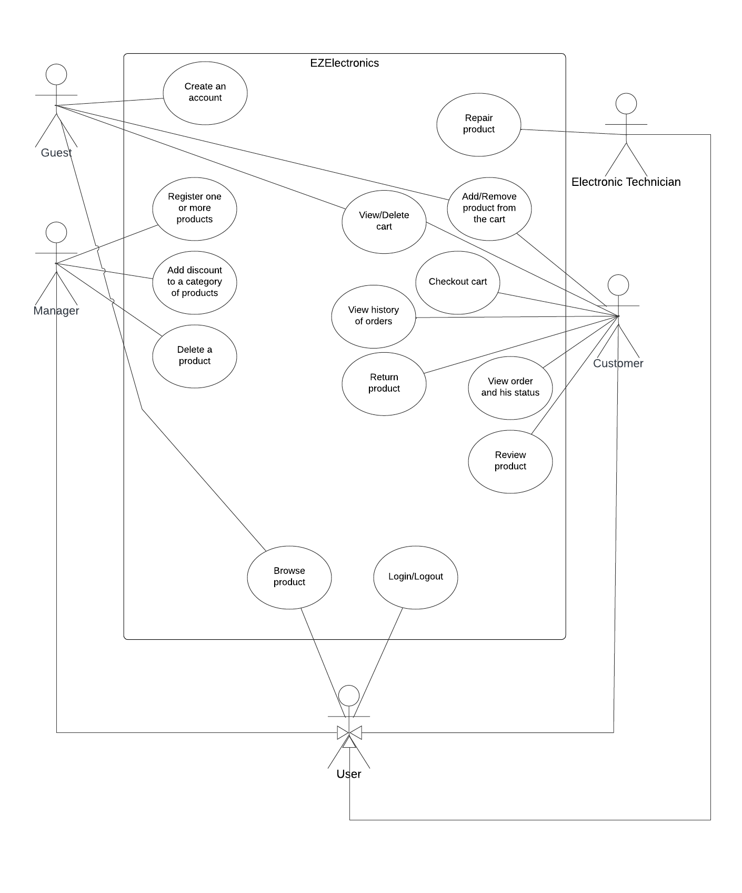

# Requirements Document - current EZElectronics

Date: 2024-05-05

Version: V2 - description of EZElectronics in FUTURE form (as improved from team)

| Version number |                                                       Change                                                       |
|:--------------:|:------------------------------------------------------------------------------------------------------------------:|
|     0.1.0      |                                            Add use cases with scenarios                                            |
|     0.0.5      |                                          Add non functional requirements                                           |                                                                                                                  
|     0.0.4      |                                Updated functional requirements and context diagram                                 | 
|     0.0.3      |                                              Add class diagram draft                                               |
|     0.0.2      |                           Add guest stakeholder, and add context and use cases diagrams                            |
|     0.0.1      | Add manager, customer, developer, supplier, payment provider   and draft interfaces and functional requirements |

# Contents

- [Requirements Document - current EZElectronics](#requirements-document---current-ezelectronics)
- [Contents](#contents)
- [Informal description](#informal-description)
- [Stakeholders](#stakeholders)
- [Context Diagram and interfaces](#context-diagram-and-interfaces)
  - [Context Diagram](#context-diagram)
  - [Interfaces](#interfaces)
- [Stories and personas](#stories-and-personas)
- [Functional and non functional requirements](#functional-and-non-functional-requirements)
  - [Functional Requirements](#functional-requirements)
  - [Non Functional Requirements](#non-functional-requirements)
- [Use case diagram and use cases](#use-case-diagram-and-use-cases)
  - [Use case diagram](#use-case-diagram)
    - [Use case 1, UC1](#use-case-1-uc1)
      - [Scenario 1.1](#scenario-1-1)
      - [Scenario 1.2](#scenario-1-2)
      - [Scenario 1.3](#scenario-1-3)
    - [Use case 2, UC2](#use-case-2-uc2)
      - [Scenario 2.1](#scenario-2-1)
      - [Scenario 2.2](#scenario-2-2)
    - [Use case 3, UC3](#use-case-3-uc3)
      - [Scenario 3.1](#scenario-3-1)
      - [Scenario 3.2](#scenario-3-2)
      - [Scenario 3.3](#scenario-3-3)
      - [Scenario 3.4](#scenario-3-4)
      - [Scenario 3.5](#scenario-3-5)
    - [Use case 4, UC4](#use-case-4-uc4)
      - [Scenario 4.1](#scenario-4-1)
      - [Scenario 4.2](#scenario-4-2)
    - [Use case 5, UC5](#use-case-5-uc5)
      - [Scenario 4.2](#scenario-4-2)
      - [Scenario 4.2](#scenario-4-2)
      - [Scenario 4.2](#scenario-4-2)
      - [Scenario 4.2](#scenario-4-2)
    - [Use case 6, UC6](#use-case-6-uc6)
      - [Scenario 5.1](#scenario-5-1)
      - [Scenario 5.2](#scenario-5-2)
      - [Scenario 5.3](#scenario-5-3)
    - [Use case 7, UC7](#use-case-7-uc7)
      - [Scenario 7.1](#scenario-7-1)
      - [Scenario 7.2](#scenario-7-2)
      - [Scenario 7.3](#scenario-7-3)
      - [Scenario 7.4](#scenario-7-4)
    - [Use case 8, UC8](#use-case-8-uc8)
      - [Scenario 8.1](#scenario-8-1)
      - [Scenario 8.2](#scenario-8-2)
      - [Scenario 8.3](#scenario-8-3)
    - [Use case 9, UC9](#use-case-9-uc9)
      - [Scenario 9.1](#scenario-9-1)
      - [Scenario 9.2](#scenario-9-2)
    - [Use case 10, UC10](#use-case-10-uc10)
      - [Scenario 10.1](#scenario-10-1)
      - [Scenario 10.2](#scenario-10-2)
    - [Use case 11, UC11](#use-case-11-uc11)
      - [Scenario 11.1](#scenario-11-1)
      - [Scenario 11.2](#scenario-11-2)
      - [Scenario 11.3](#scenario-11-3)
      - [Scenario 11.4](#scenario-11-4)
    - [Use case 12, UC12](#use-case-12-uc12)
      - [Scenario 12.1](#scenario-12-1)
      - [Scenario 12.2](#scenario-12-2)
    - [Use case 13, UC13](#use-case-13-uc13)
      - [Scenario 13.1](#scenario-13-1)
      - [Scenario 13.2](#scenario-13-2)
    - [Use case 14, UC14](#use-case-14-uc14)
      - [Scenario 14.1](#scenario-14-1)
      - [Scenario 14.2](#scenario-14-2)
    - [Use case 15, UC15](#use-case-15-uc15)
      - [Scenario 15.1](#scenario-15-1)
      - [Scenario 15.2](#scenario-15-2)
    - [Use case 16, UC16](#use-case-16-uc16)
      - [Scenario 16.1](#scenario-16-1)
      - [Scenario 16.2](#scenario-16-2)
    - [Use case 17, UC17](#use-case-17-uc17)
      - [Scenario 17.1](#scenario-17-1)
      - [Scenario 17.2](#scenario-17-2)
    - [Use case 18, UC18](#use-case-18-uc18)
      - [Scenario 18.1](#scenario-18-1)
      - [Scenario 18.2](#scenario-18-2)
      - [Scenario 18.3](#scenario-18-3)
    - [Use case 19, UC19](#use-case-19-uc19)
      - [Scenario 19.1](#scenario-19-1)
      - [Scenario 19.2](#scenario-19-2)
- [Glossary](#glossary)
- [System Design](#system-design)
- [Deployment Diagram](#deployment-diagram)

# Informal description

EZElectronics is a software application designed to help managers of electronics stores to manage their products through a dedicated website. On the customer front, EZElectronics offers a user-friendly interface where customers can browse available products, add desired items to a cart, and make purchases. Post-purchase, customers have the ability to review their bought products, enhancing the shopping experience and providing valuable feedback for both the store and future customers.  The application also keeps a detailed history of purchases and returns, allowing customers to track their past transactions and managers to monitor return patterns. In the event of a product being damaged, the application facilitates the return process and even allows for the product to be repaired by a technician.  Furthermore, EZElectronics supports the implementation of category-based discounts, providing an additional marketing tool for managers and savings opportunities for customers. The application, therefore, serves as a comprehensive solution for both the management of electronics stores and the enhancement of the customer shopping experience.

# Stakeholders

| Stakeholder name |           Description            |
|:----------------:|:--------------------------------:|
|   User Manager   |  manages the electronics store   |
|  User Customer   |    buys electronics products     |  
|      Guest       | visits the site for registration |
|    Technician    |          Fixes devices           |
|    Developer     |    develops the EZElectronics    |
|     Supplier     |     supplies the electronics     |
| Payment Provider |    provides payment services     |

# Context Diagram and interfaces

## Context Diagram

\<Define here Context diagram using UML use case diagram>

 

## Interfaces

 

|      Actor       | Logical Interface | Physical Interface |
|:----------------:|:-----------------:|:------------------:|
|     Manager      |        GUI        |         PC         |
|     Customer     |        GUI        |         PC         |
|      Guest       |        GUI        |         PC         |
|    Technician    |        GUI        |         PC         |
|    Developer     |     GUI, API      |         PC         |
| Payment Provider |        API        |      internet      |

# Stories and personas

 

# Functional and non functional requirements

## Functional Requirements

 

|  ID   |                                     Description                                      |
|:-----:|:------------------------------------------------------------------------------------:|
|  FR1  |                         Manage products of electronics store                         |
| FR1.0 |                               Register one new product                               |
| FR1.1 |                     Register the arrival of new set of products                      |
| FR1.2 |                                Mark a product as sold                                |
| FR1.3 |                                  Delete one product                                  |
| FR1.4 |                         Create price discounts by category                           |
|  FR2  |                                   Browse products                                    |
| FR2.1 | View all products in the store, with possibility of filtering available or sold ones |
| FR2.2 |                      Search for a specific product by its code                       |
| FR2.3 |                  View all products of a specific category or model                   |
|  FR3  |                              Manage customer purchases                               |
| FR3.0 |                 Add or remove a product from the cart of a customer                  |
| FR3.1 |                                  Checkout the cart                                   |
| FR3.2 |                                  View current cart                                   |
| FR3.3 |               View the history of all purchases of a specific customer               |
| FR3.4 |                                 Delete current cart                                  |
|  FR4  |                                 Manage user accounts                                 |
| FR4.0 |                  Register a new account as a customer or a manager                   |
| FR4.1 |               Authenticate a user with a username and password (Login)               |
| FR4.2 |                                     Logout user                                      |
| FR4.3 |                    Authorize a user to perform a specific action                     |
|  FR5  |                               Manage Customer orders                                 |
| FR5.0 |                                 Check order history                                  |
| FR5.1 |                               review products in order                               |
| FR5.2 |                                  view order status                                   |
| FR5.3 |                             create return for products                               |
|  FR6  |                                 Handle of repairs                                    |
| FR6.0 |                                  Repair product                                      |

[//]: # (|  FR5  |             Testing functionalities of the EZElectronics system              |)

[//]: # (| FR5.0 |                Delete all products or carts or user accounts                 |)

[//]: # (| FR5.1 |                     Delete user account by its username                      |)

[//]: # (| FR5.2 | View the list of all users in the system,   filtered by role or username |)

## Non Functional Requirements

 

|   ID    | Type (efficiency, reliability, ..) |                                      Description                                       |     Refers to     |
|:-------:|:----------------------------------:|:--------------------------------------------------------------------------------------:|:-----------------:|
|  NFR1   |             Usability              |        A user manager should be taught to use the software properly in 2 hours         |        FR1        |
|  NFR2   |             Usability              |                A user should learn how to browse products in 15 minutes                |      FR2/FR3      |
|  NFR3   |             Usability              |      The proccess of registration of a guest should be done at most in 5 minutes       |       FR4.0       |
|  NFR4   |             Efficiency             |                   All users response time should be less than 1 sec                    | FR1/FR2, FR3, FR4 |
|  NFR5   |            Reliability             | An available product can be mark as out of stock at most once per year, and vice versa |       FR2.1       |
|  NFR6   |            Reliability             | It should have a robust error handling to prevent data loss and ensure data integrity  |   FR1, FR3, FR4   |
|  NFR7   |            Reliability             |                      The server must be online at 95% of the day                       |                   |
|  NFR8   |          Maintainability           |  The amount of time per week spent on fixing bugs has to be less than 4 person hours   |                   |
|  NFR9   |          Maintainability           | Integration of new features with the code base should require less than 2 person hours |                   |
|  NFR10  |              Security              |                        All passwords of users must be encrypted                        |                   |
|  NF11   |              Security              |          Permissions of different user should be manage by design and default          |                   |

# Use case diagram and use cases

## Use case diagram

 

\<next describe here each use case in the UCD>

### Use case 1, UC1

| Actors Involved  |                  Manager                                             |
|:----------------:|:--------------------------------------------------------------------:|
|   Precondition   | New unregistered product                                             |
|  Post condition  | new registered product in the store                                  |
| Nominal Scenario | The system asks for product parameters and a new product is created  |
|     Variants     | None                                                                 |
|    Exceptions    | Product already exists or invalid parameters                         |

 

#### Scenarios

|  Scenario 1.1  | Manager wants to register a new product                                   |
|:--------------:|:-------------------------------------------------------------------------:|
|  Precondition  | Manager wants to register a new product                                   |
| Post condition | new product registered in the system                                      |

|     Step#      |               System              |               User                    |
|----------------|-----------------------------------|---------------------------------------|
|       1        |                          | A manager wishes to register a new product     |
|       2        | Ask for code, price, model, category, details and arrival date |          |
|       3        || The manager inserts all of the parameters specified                      |
|       4        | Check if parameters are within the constraints |                          |
|       5        | The system registers the new product |                                    |

 
 

|  Scenario 1.2  | Manager wants to register a duplicate product                             |
|:--------------:|:-------------------------------------------------------------------------:|
|  Precondition  | Manager wants to register a new product                                   |
| Post condition | Manager prompted to check the product code                                |

|     Step#      |               System              |               User                    |
|----------------|-----------------------------------|---------------------------------------|
|       1        |                          | A manager wishes to register a new product     |
|       2        | Ask for code, price, model, category, details and arrival date |          |
|       3        || The manager inserts all of the parameters specified but with an already 
existing code                                                                                |
|       4        | Check if parameters are within the constraints |                          |
|       5        | The system prompts the manager to check the code  |                       |

 
 

|  Scenario 1.3  | Manager wants to register a new product with the wrong arrival date       |
|:--------------:|:-------------------------------------------------------------------------:|
|  Precondition  | Manager wants to register a new product                                   |
| Post condition | Manager prompted to double check the arrival Date inserted                |

|     Step#      |               System              |               User                    |
|----------------|-----------------------------------|---------------------------------------|
|       1        |                          | A manager wishes to register a new product     |
|       2        | Ask for code, price, model, category, details and arrival date |          |
|       3        || The manager inserts all of the parameters specified with an arrival date 
after the current date                                                                       |
|       4        | Check if parameters are within the constraints |                          |
|       5        | The system prompts the manager to double check the arrival date |         |

 
 

### Use case 2, UC2

| Actors Involved  |                  Manager                                             |
|:----------------:|:--------------------------------------------------------------------:|
|   Precondition   | arrival of registered product for inventory                          |
|  Post condition  | updated product quantity                                             |
| Nominal Scenario | The system asks for quantity to add and the inventory is updated     |
|     Variants     | None                                                                 |
|    Exceptions    | invalid parameters                                                   |
 

#### Scenarios

|  Scenario 2.1  | Manager wants to update product quantity                                  |
|:--------------:|:-------------------------------------------------------------------------:|
|  Precondition  | Manager wants to update product quantity                                  |
| Post condition | updated product quantity                                                  |

|     Step#      |               System              |               User                    |
|----------------|-----------------------------------|---------------------------------------|
|       1        |                          | A manager wishes to add product quantity       |
|       2        | Ask for price, model, category, details and arrival date |          |
|       3        || The manager inserts all of the parameters specified                      |
|       4        | Check if parameters are within the constraints |                          |
|       5        | The system registers the new product |                                    |

 
 

|  Scenario 2.2  | Manager wants to update product quantity with arrival date after the current date |
|:--------------:|:-------------------------------------------------------------------------:|
|  Precondition  | Manager wants to update product quantity with date after current date     |
| Post condition | prompts manager to check arrival Date                                     |

|     Step#      |               System              |               User                    |
|----------------|-----------------------------------|---------------------------------------|
|       1        |                          | A manager wishes to add product quantity       |
|       2        | Ask for price, model, category, details and arrival date |                |
|       3        || The manager inserts all of the parameters specified (date after current) |
|       4        | Check if parameters are within the constraints |                          |
|       5        | The system prompts the manager to check the arrival Date |                |

 
 

### Use case 3, UC3

| Actors Involved  |                  Manager                                             |
|:----------------:|:--------------------------------------------------------------------:|
|   Precondition   | a product sale is about to occur                                     |
|  Post condition  | products are marked as sold in the system                            |
| Nominal Scenario | The system asks for quantity to add and the inventory is updated     |
|     Variants     | None                                                                 |
|    Exceptions    | invalid parameters                                                   |
 

#### Scenarios

|  Scenario 3.1  | Manager wants to mark product as sold                                  |
|:--------------:|:-------------------------------------------------------------------------:|
|  Precondition  | Manager wants mark product as sold                                        |
| Post condition | product marked as sold                                                    |

|     Step#      |               System              |               User                    |
|----------------|-----------------------------------|---------------------------------------|
|       1        |                          | A manager wishes to mark product as sold       |
|       2        | Ask for code and selling date     |                                       |
|       3        || The manager inserts all of the parameters specified                      |
|       4        | Check if parameters are within the constraints |                          |
|       5        | The system registers the new product |                                    |

 
 

|  Scenario 3.2  | Manager wants to mark product as sold with date after current             |
|:--------------:|:-------------------------------------------------------------------------:|
|  Precondition  | Manager wants mark product as sold with date after current date           |
| Post condition | prompts manager to check selling Date                                     |

|     Step#      |               System              |               User                    |
|----------------|-----------------------------------|---------------------------------------|
|       1        |                          | A manager wishes to add product quantity       |
|       2        | Ask for price, model, category, details and arrival date |                |
|       3        || The manager inserts all of the parameters specified (date after current) |
|       4        | Check if parameters are within the constraints |                          |
|       5        | The system prompts the manager to check the arrival Date |                |

 
 

|  Scenario 3.3  | Manager wants to mark product as sold with date before arrivalDate        |
|:--------------:|:-------------------------------------------------------------------------:|
|  Precondition  | Manager wants mark product as sold with date after before arrivalDate     |
| Post condition | prompts manager to check selling Date                                     |

|     Step#      |               System              |               User                    |
|----------------|-----------------------------------|---------------------------------------|
|       1        |                          | A manager wishes to add product quantity       |
|       2        | Ask for price, model, category, details and arrival date |                |
|       3        || The manager inserts all of the parameters specified (date before arrival)|
|       4        | Check if parameters are within the constraints |                          |
|       5        | The system prompts the manager to check the sellingDate |                 |

 
 

|  Scenario 3.4  | Manager wants to mark product as sold with wrong code                     |
|:--------------:|:-------------------------------------------------------------------------:|
|  Precondition  | Manager wants mark product as sold with a non existing code               |
| Post condition | prompts manager to check product code                                     |

|     Step#      |               System              |               User                    |
|----------------|-----------------------------------|---------------------------------------|
|       1        |                          | A manager wishes to add product quantity       |
|       2        | Ask for price, model, category, details and arrival date |                |
|       3        || The manager inserts all of the parameters specified (non existing code)  |
|       4        | Check if parameters are within the constraints |                          |
|       5        | The system prompts the manager to check product code |                    |

 
 

|  Scenario 3.5  | Manager wants to mark already sold product as sold                        |
|:--------------:|:-------------------------------------------------------------------------:|
|  Precondition  | Manager wants mark product as sold with date after current date           |
| Post condition | prompts manager to check product code                                     |

|     Step#      |               System              |               User                    |
|----------------|-----------------------------------|---------------------------------------|
|       1        |                          | A manager wishes to add product quantity       |
|       2        | Ask for price, model, category, details and arrival date |                |
|       3        || The manager inserts all of the parameters specified (product code already sold) |
|       4        | Check if parameters are within the constraints |                          |
|       5        | The system prompts the manager to check the product code |                |

 
 

### Use case 4, UC4

| Actors Involved  |                  Manager                                             |
|:----------------:|:--------------------------------------------------------------------:|
|   Precondition   | a product must be deleted                                            |
|  Post condition  | product deleted from the system                                      |
| Nominal Scenario | The system asks for the product code and deletes it from the system  |
|     Variants     | None                                                                 |
|    Exceptions    | invalid parameters                                                   |
 

#### Scenarios

|  Scenario 4.1  | Manager wants to delete product                                           |
|:--------------:|:-------------------------------------------------------------------------:|
|  Precondition  | Manager wants to delete a product                                         |
| Post condition | product deleted from system                                               |

|     Step#      |               System              |               User                    |
|----------------|-----------------------------------|---------------------------------------|
|       1        |                          | A manager wishes to delete a product           |
|       2        | Ask for product code     |                                                |
|       3        || The manager inserts the product code to delete                           |
|       4        | Check if code exists |                                                    |
|       5        | The system deletes the product |                                          |

 
 

|  Scenario 4.2  | Manager wants to delete product with the wrong code                       |
|:--------------:|:-------------------------------------------------------------------------:|
|  Precondition  | Manager wants to delete a product but has the wrong code                  |
| Post condition | prompts manager to check the product code                                 |

|     Step#      |               System              |               User                    |
|----------------|-----------------------------------|---------------------------------------|
|       1        |                          | A manager wishes to delete a product           |
|       2        | Ask for product code     |                                                |
|       3        || The manager inserts the product code to delete                           |
|       4        | Check if code exists |                                                    |
|       5        | The system prompts the manager to check the product code |                |

 
 

### Use case 5, UC5

| Actors Involved  |                                      User / Guest                               |
|:----------------:|:-------------------------------------------------------------------------------:|
|   Precondition   | Anyone (user or guest) wants to know all the products of a specific category or model |
|  Post condition  |                                  Product shown                                  |
| Nominal Scenario |        The system shows all the products which satisfy the requirements         |
|     Variants     |                    User wants to see only the sold products                     |
|    Exceptions    |                                  Server error                                   |

 

#### Scenarios

|  Scenario 5.1  |        User wants to see all the products of a specific category         |
|:--------------:|:------------------------------------------------------------------------:|
|  Precondition  | An user or guest wants to see some products based on a specific category |
| Post condition |                              Products shown                              |

|     Step#      | System                                                                              | User                                                        |
|----------------|-------------------------------------------------------------------------------------|-------------------------------------------------------------|
|       1        |                                                                                     | An user or guest wants to browse for some products          |
|       2        | Asks for the category and if the user want to see only sold products or yet to sell |                                                             |
|       3        |                                                                                     | The user inserts the category and the status of the product |
|       4        | Browses all the products which satisfy the requests                                 |                                                             |
|       5        | If any product is found, show it                                                    |                                                             |
|       6        |                                                                                     | All the required products are on screen                     |

 
 

|  Scenario 5.2  |        User wants to see all the products of a specific model         |
|:--------------:|:---------------------------------------------------------------------:|
|  Precondition  | An user or guest wants to see some products based on a specific model |
| Post condition |                            Products shown                             |

|     Step#      | System                                                                           | User                                                     |
|----------------|----------------------------------------------------------------------------------|----------------------------------------------------------|
|       1        |                                                                                  | An user or guest wants to browse for some products       |
|       2        | Asks for the model and if the user want to see only sold products or yet to sell |                                                          |
|       3        |                                                                                  | The user inserts the model and the status of the product |
|       4        | Browses all the products which satisfy the requests                              |                                                          |
|       5        | If any product is found, show it                                                 |                                                          |
|       6        |                                                                                  | All the required products are on screen                  |

 
 

|  Scenario 5.3  | An user or guest wants to see only the available products of a model/category |
|:--------------:|:---------------------------------------------------------------------:|
|  Precondition  | An user or guest wants to see some products based on its availability |
| Post condition |                            Products shown                             |

|     Step#      | System                                                                             | User                                                                       |
|----------------|------------------------------------------------------------------------------------|----------------------------------------------------------------------------|
|       1        |                                                                                   | An user or guest wants to know if a specific product it's available |
|       2        | Asks for the product and to check the flag for browsing only the available products |                                                                            |
|       3        |                                                                                    | The user inserts the model and checks the flag                             |
|       4        | Browses all the products which satisfy the requests                                |                                                                            |
|       5        | If any product is found, show it                                                   |                                                                            |
|       6        |                                                                                    | All the required products are on screen                                    |
 
 

### Use case 6, UC6

| Actors Involved  |           Customer / Guest                 |
|:----------------:|:------------------------------------------:|
|   Precondition   | User or Guest is on the website            |
|  Post condition  |           Shows the current cart           |
| Nominal Scenario | User or Guest wants to see his current cart|
|    Exceptions    |               Cart is empty                |
 

##### Scenarios

|  Scenario 6.1  | User or Guest wants to see his current cart with 2 products.        |
|:--------------:|:--------------------------------------------------------------:|
|  Precondition  | User or Guest has a cart and wants to see the current cart          |
| Post condition |      The current cart is shown to the customer                 |

| Step# | System                                            | Customer / Guest                                         |
|-------|---------------------------------------------------|--------------------------------------------------|
| 1     |                                                   | User or Guest wants to see the current cart           |
| 2     | System checks if the cart is empty                |                                                  |
| 3     | System shows the current cart                     |                                                  |
| 4     |                                                   | The current cart is shown to the User or Guest        |

 
 

|  Scenario 6.2  | User or Guest wants to see his current cart which is it empty.      |
|:--------------:|:---------------------------------------------------------------:|
|  Precondition  | User or Guest has a cart and wants to see the current cart          |
| Post condition |      System tells the cart is empty                           |

| Step# | System                                            | Customer / Guest                                         |
|-------|---------------------------------------------------|--------------------------------------------------|
| 1     |                                                   | User or Guest wants to see the current cart           |
| 2     | System checks if the cart is empty                |                                                  |
| 3     | System shows the current cart                     |                                                  |
| 4     |                                                   | System tells the cart is empty                   |

 
 

### Use case 7, UC7

| Actors Involved  |                                      Customer / Guest                              |
|:----------------:|:----------------------------------------------------------------------------------:|
|   Precondition   |        User or Guest is on the website and gives the product ID         |
|  Post condition  |                            Product is added to the cart                            |
| Nominal Scenario |                    User or Guest adds a product to the current cart                     |
|    Exceptions    | Product ID does not exist, product is already in the cart, product is already sold |

[//]: # (It should return a 404 error if productId does not represent an existing product)

[//]: # (It should return a 409 error if productId represents a product that is already in another cart)

[//]: # (It should return a 409 error if productId represents a product that has already been sold)
 

##### Scenarios

|  Scenario 7.1  | User or Guest adds successfully a product to the cart.               |
|:--------------:|:---------------------------------------------------------------:|
|  Precondition  | User or Guest has a cart and gives the product ID to add to the cart |
| Post condition |      Product is added to the cart and the cart is updated       |

| Step# | System                                            | Customer / Guest                                         |
|-------|---------------------------------------------------|--------------------------------------------------|
| 1     |                                                   | User or Guest gives the product ID to add to the cart |
| 2     | System checks if the product ID exists            |                                                  |
| 3     | System checks if the product is already in a cart |                                                  |
| 4     | System checks if the product is already sold      |                                                  |
| 5     | System adds the product to the cart               |                                                  |
| 6     |                                                   | The product is added to the cart                 |

 
 

|  Scenario 7.2  | User or Guest tries to add a product that is already in a cart.      |
|:--------------:|:---------------------------------------------------------------:|
|  Precondition  | User or Guest has a cart and gives the product ID to add to the cart |
| Post condition |      System tells the product is already in the cart            |

| Step# | System                                            | Customer / Guest                                             |
|-------|---------------------------------------------------|------------------------------------------------------|
| 1     |                                                   | User or Guest gives the product ID to add to the cart     |
| 2     | System checks if the product ID exists            |                                                      |
| 3     | System checks if the product is already in a cart |                                                      |
| 4     | System checks if the product is already sold      |                                                      |
| 5     |                                                   | System tells the product is already in the cart      |

 
 

|  Scenario 7.3  | User or Guest tries to add a product that is already sold.           |
|:--------------:|:---------------------------------------------------------------:|
|  Precondition  | User or Guest has a cart and gives the product ID to add to the cart |
| Post condition |      System tells the product is already sold                 |

| Step# | System                                            | Customer / Guest                                             |
|-------|---------------------------------------------------|------------------------------------------------------|
| 1     |                                                   | User or Guest gives the product ID to add to the cart     |
| 2     | System checks if the product ID exists            |                                                      |
| 3     | System checks if the product is already in a cart |                                                      |
| 4     | System checks if the product is already sold      |                                                      |
| 5     |                                                   | System tells the product is already sold             |

 
 

|  Scenario 7.4  | User or Guest tries to add a product that does not exist.            |
|:--------------:|:---------------------------------------------------------------:|
|  Precondition  | User or Guest has a cart and gives the product ID to add to the cart |
| Post condition |      System tells the product does not exist                 |

| Step# | System                                            | Customer / Guest                                             |
|-------|---------------------------------------------------|------------------------------------------------------|
| 1     |                                                   | User or Guest gives the product ID to add to the cart     |
| 2     | System checks if the product ID exists            |                                                      |
| 3     | System checks if the product is already in a cart |                                                      |
| 4     | System checks if the product is already sold      |                                                      |
| 5     |                                                   | System tells the product does not exist             |

### Use case 8, UC8

| Actors Involved  |                                               Customer / Guest                                               |
|:----------------:|:----------------------------------------------------------------------------------------------------:|
|   Precondition   |                 User or Guest gives the product ID                 |
|  Post condition  |                                   Product is removed from the cart                                   |
| Nominal Scenario |                           User or Guest removes a product from the current cart                           |
|    Exceptions    | It cannot be empty, it must be a valid product id, it must represent a product that is in the cart.  |
 

##### Scenarios

|  Scenario 8.1 | User or Guest removes successfully a product from the cart.           |
|:--------------:|:---------------------------------------------------------------:|
|  Precondition  | User or Guest has a cart and gives the product ID to remove from it  |
| Post condition |      Product is removed from the cart and the cart is updated   |

| Step# | System                                            | Customer / Guest                                         |
|-------|---------------------------------------------------|--------------------------------------------------|
| 1     |                                                   | User or Guest gives the product ID to remove from it  |
| 2     | System checks if the product ID exists            |                                                  |
| 3     | System checks if the product is in the cart       |                                                  |
| 4     | System removes the product from the cart          |                                                  |
| 5     |                                                   | The product is removed from the cart             |

 
 

|  Scenario 8.2 | User or Guest tries to remove a product that is not in the cart.      |
|:--------------:|:---------------------------------------------------------------:|
|  Precondition  | User or Guest has a cart and gives the product ID to remove from it  |
| Post condition |      System tells the product is not in the cart                |

| Step# | System                                            | Customer / Guest                                         |
|-------|---------------------------------------------------|--------------------------------------------------|
| 1     |                                                   | User or Guest gives the product ID to remove from it  |
| 2     | System checks if the product ID exists            |                                                  |
| 3     | System checks if the product is in the cart       |                                                  |
| 4     | System tells the product is not in the cart       |                                                  |

 
 

|  Scenario 8.3 | User or Guest tries to remove a product from an empty cart.           |
|:--------------:|:---------------------------------------------------------------:|
|  Precondition  | User or Guest has a cart and gives the product ID to remove from it  |
| Post condition |      System tells the cart is empty                             |

| Step# | System                                            | Customer / Guest                                         |
|-------|---------------------------------------------------|--------------------------------------------------|
| 1     |                                                   | User or Guest gives the product ID to remove from it  |
| 2     | System checks if the product ID exists            |                                                  |
| 3     | System checks if the product is in the cart       |                                                  |
| 4     |                                                   | System tells the cart is empty                   |

### Use case 9, UC9

[//]: # (checkout current cart)

| Actors Involved  |                  Customer                  |
|:----------------:|:------------------------------------------:|
|   Precondition   | User has an account and user is a customer |
|  Post condition  |            Cart is checked out             |
| Nominal Scenario |    Customer checks out the current cart    |
|    Exceptions    |               Cart is empty                |
 

##### Scenarios

|  Scenario 9.1 | Customer checks out the current cart.                        |
|:--------------:|:-----------------------------------------------------------:|
|  Precondition  | Customer has a cart and wants to check out the current cart |
| Post condition |       Cart is checked out and the cart becomes empty        |

| Step# | System                                            | Customer                                         |
|-------|---------------------------------------------------|--------------------------------------------------|
| 1     |                                                   | Customer wants to check out the current cart     |
| 2     | System checks if the cart is empty                |                                                  |
| 3     | System checks out the cart                        |                                                  |
| 4     |                                                   | The cart is checked out and becomes empty        |

 
 

|  Scenario 9.2 | Customer tries to check out an empty cart.                   |
|:--------------:|:-----------------------------------------------------------:|
|  Precondition  | Customer has a cart and wants to check out the current cart |
| Post condition |               System tells the cart is empty                |

| Step# | System                                            | Customer                                         |
|-------|---------------------------------------------------|--------------------------------------------------|
| 1     |                                                   | Customer wants to check out the current cart     |
| 2     | System checks if the cart is empty                |                                                  |
| 3     | System checks out the cart                        |                                                  |
| 4     |                                                   | System tells the cart is empty                   |

 
 

### Use case 10, UC10

| Actors Involved  |                  Manager                                          |
|:----------------:|:--------------------------------------------------------------------:|
|   Precondition   | existing products and categories                                     |
|  Post condition  | discounts applied on stocked products by category                    |
| Nominal Scenario | manager can select a category of products to be discounted           |
|     Variants     | None                                                                 |
|    Exceptions    | Category doesn't exist                                               |
 

#### Scenarios

|  Scenario 10.1 | Manager applies discount for category                                     |
|:--------------:|:-------------------------------------------------------------------------:|
|  Precondition  | System has products with categories                                       |
| Post condition | Discounts will be applied to products with selected category              |

|     Step#      |               System              |               User                    |
|----------------|-----------------------------------|---------------------------------------|
|       1        |                           | A manager selects a category to be discounted |
|       2        | System checks for category        |                                       |
|       3        | System applies discount           |                                       |

 
 

|  Scenario 10.2 | Manager applies discount for category but it doesn't exist                |
|:--------------:|:-------------------------------------------------------------------------:|
|  Precondition  | System has products with categories                                       |
| Post condition | System prompts manager to check the category                              |

|     Step#      |               System              |               User                    |
|----------------|-----------------------------------|---------------------------------------|
|       1        |                           | A manager selects a category to be discounted |
|       2        | System checks for category        |                                       |
|       3        | System prompts manager to check the category inserted |                   |

 
 

### Use case 11, UC11

| Actors Involved  |                  Guest User                                          |
|:----------------:|:--------------------------------------------------------------------:|
|   Precondition   | Person without credentials with a stake in the shop                  |
|  Post condition  | Account created                                                      |
| Nominal Scenario | The system asks for a user and password, the credentials are accepted and an account is created                                                                     |
|     Variants     | When the account is created it can be manager or customer            |
|    Exceptions    | Username already taken, password doesn't meet requirements           |
 

#### Scenarios

|  Scenario 11.1  | Guest wants to create customer account                                    |
|:--------------:|:-------------------------------------------------------------------------:|
|  Precondition  | A Guest without credentials wants to create an account                    |
| Post condition |  A Guest account is created and now it's logged in                        |

|     Step#      |               System              |               User                    |
|----------------|-----------------------------------|---------------------------------------|
|       1        |                          | A guest without credentials loads the website  |
|       2        | Ask for username and password |                                           |
|       3        || The Guest inserts the username and password and selects the Customer role|
|       4        | Check if Username is available and password meets requirements |          |
|       5        | The system creates the account and logs the user in |                     |
|       6        |                                | The Guest is now logged in as a Customer |

 
 

|  Scenario 11.2  | manager wants to create a manager account                                 |
|:--------------:|:-------------------------------------------------------------------------:|
|  Precondition  | A manager without credentials wants to create an account                  |
| Post condition |  A manager account is created and now it's logged in                      |

|     Step#      |               System              |               User                    |
|----------------|-----------------------------------|---------------------------------------|
|       1        |                        | A manager without credentials loads the website  |
|       2        | Ask for username and password |                                           |
|       3        || The manager inserts the username and password and selects the manager role|
|       4        | Check if Username is available and password meets requirements |          |
|       5        | The system creates the account and logs the user in |                     |
|       6        |                               | The manager is now logged in as a manager |

 
 

|  Scenario 11.3  | Username already exists                                                   |
|:--------------:|:-------------------------------------------------------------------------:|
|  Precondition  | A user without credentials wants to create an account                     |
| Post condition | The user will be prompted to use a different username                     |

|     Step#      |               System              |               User                    |
|----------------|-----------------------------------|---------------------------------------|
|       1        |                           | A user without credentials loads the website  |
|       2        | Ask for username and password |                                           |
|       3        |  | The user inserts the username and password and selects the role        |
|       4        | Check if Username is available and password meets requirements |          |
|       5        | The system prompts the user to use a different username |                 |

 
 

|  Scenario 11.4  | Password not strong enough                                                |
|:--------------:|:-------------------------------------------------------------------------:|
|  Precondition  | A user without credentials wants to create an account                     |
| Post condition | The user will be prompted to use a different password                     |

|     Step#      |               System              |               User                    |
|----------------|-----------------------------------|---------------------------------------|
|       1        |                           | A user without credentials loads the website  |
|       2        | Ask for username and password |                                           |
|       3        |  | The user inserts the username and password and selects the role        |
|       4        | Check if Username is available and password meets requirements |          |
|       5        | The system prompts the user to use a different password |                 |

 
 

### Use case 12, UC12

| Actors Involved  |                            User                             |
|:----------------:|:-----------------------------------------------------------:|
|   Precondition   |            User with credentials wants to login             |
|  Post condition  |                       User logged in                        |
| Nominal Scenario |     The system checks whether the credentials are right     |
|     Variants     | User wants to login as a manager instead that as a customer |
|    Exceptions    |                 Wrong username or password                  |
 

#### Scenarios

|  Scenario 12.1  |          User wants to login           |
|:--------------:|:--------------------------------------:|
|  Precondition  | A user without credentials wants login |
| Post condition |         The user is logged in          |

|     Step#      | System                                                            | User                                                |
|----------------|-------------------------------------------------------------------|-----------------------------------------------------|
|       1        |                                                                   | A user with credentials loads the website           |
|       2        | Ask for username and password                                     |                                                     |
|       3        |                                                                   | The user inserts the username and password          |
|       4        | Check if username and password match with the one in the database |                                                     |
|       5        | The system logs the user in               |                                                     |
|       6        |                                                                   | The user is now logged in with its right privileges |

 
 

|  Scenario 12.2  |          User wants to login           |
|:--------------:|:--------------------------------------:|
|  Precondition  | A user without credentials wants login |
| Post condition |     The user is asked to try again     |

|     Step#      | System                                                           | User                                                |
|----------------|------------------------------------------------------------------|-----------------------------------------------------|
|       1        |                                                                  | A user with credentials loads the website           |
|       2        | Ask for username and password                                    |                                                     |
|       3        |                                                                  | The user inserts the username and password          |
|       4        | Check if username and password match with the one in the database |                                                     |
|       5        | Wrong username or password                                       |                                                     |
|       6        | Ask again for username and password                              | |

 
 

### Use case 13, UC13

| Actors Involved  |                        User                         |
|:----------------:|:---------------------------------------------------:|
|   Precondition   |       User already logged in wants to logout        |
|  Post condition  |                 User session closed                 |
| Nominal Scenario | The system logs out the user and closes the session |
|    Exceptions    |                    Server error                     |
 

#### Scenarios

|  Scenario 13.1  |           User wants to logout           |
|:--------------:|:----------------------------------------:|
|  Precondition  | A user already logged in wants to logout |
| Post condition |          The user is logged out          |

|     Step#      | System                                                           | User                                       |
|----------------|------------------------------------------------------------------|--------------------------------------------|
|       1        |                                                                  | A user asks the website to be logged out   |
|       2        | Logs out the user                                                |                                            |

 
 

|  Scenario 13.2  |                   User wants to logout                   |
|:--------------:|:--------------------------------------------------------:|
|  Precondition  |         A user already logged in wants to logout         |
| Post condition | The user is still logged in as the server is unreachable |

| Step# | System                                 | User                                       |
|-------|----------------------------------------|--------------------------------------------|
| 1     |                                        | A user asks the website to be logged out   |
| 2     | Tries to log out the user              |                                            |
| 3     | Server does not respond to the request |                                            |

 
 

### Use case 14, UC14

| Actors Involved  |                                    User                                    |
|:----------------:|:--------------------------------------------------------------------------:|
|   Precondition   | User already logged in wants to know the information about its own profile |
|  Post condition  |                             Information shown                              |
| Nominal Scenario |    The sy7stem checks whether the user is logged in and shows the infos    |
|    Exceptions    |                             User not logged in                             |
 

#### Scenarios

|  Scenario 14.1  |    User wants to know the info of his profile    |
|:--------------:|:------------------------------------------------:|
|  Precondition  | A user already logged in wants to know the infos |
| Post condition |                   Infos shown                    |

| Step# | System                          | User                                                              |
|-------|---------------------------------|-------------------------------------------------------------------|
| 1     |                                 | A user asks the website to know the information about its profile |
| 2     | Checks if the user is logged in |                                                                   |
| 3     | Shows the infos                 |                                                                   |

 
 

|  Scenario 14.2  |    User wants to know the info of his profile    |
|:--------------:|:------------------------------------------------:|
|  Precondition  | A user already logged in wants to know the infos |
| Post condition |              The request is refused              |

| Step# | System                          | User                                       |
|-------|---------------------------------|--------------------------------------------|
| 1     |                                 | A user asks the website to know the information about its profile   |
| 2     | Checks if the user is logged in |                                            |
| 3     | Request refused                 |                                            |

 
 

### Use case 15, UC15

| Actors Involved  |                  Customer                                             |
|:----------------:|:--------------------------------------------------------------------:|
|   Precondition   | a Customer has previous orders                                       |
|  Post condition  | the customer will be able to view order history                      |
| Nominal Scenario | the system loads all previous and ongoing orders for the customer to see |
|     Variants     | None                                                                 |
|    Exceptions    | no previous orders                                                   |
 

#### Scenarios

|  Scenario 15.1  | Customer has previous, ongoing or both kinds of orders                    |
|:--------------:|:-------------------------------------------------------------------------:|
|  Precondition  | Customer has previous orders                                              |
| Post condition | customer views order history                                              |

|     Step#      |               System              |               User                    |
|----------------|-----------------------------------|---------------------------------------|
|       1        |                          | A Customer wishes to view order history        |
|       2        | load previous orders     |                                                |
|       3        || views order history                                                      |

 
 

|  Scenario 15.2  | Customer hasn't done any orders                                           |
|:--------------:|:-------------------------------------------------------------------------:|
|  Precondition  | Customer without previous orders                                          |
| Post condition | Customer won't see orders                                                 |

|     Step#      |               System              |               User                    |
|----------------|-----------------------------------|---------------------------------------|
|       1        |                          | A Customer wishes to view order history        |
|       2        | load previous orders     |                                                |
|       3        || Can't view any orders because of none existing                           |

 
 

### Use case 16, UC16

| Actors Involved  |                  Customer                                             |
|:----------------:|:--------------------------------------------------------------------:|
|   Precondition   | a Customer has previous orders                                       |
|  Post condition  | the customer will be review products in order                        |
| Nominal Scenario | the customer adds reviews to products in ongoing or previous order   |
|     Variants     | None                                                                 |
|    Exceptions    | no previous orders                                                   |
 

#### Scenarios

|  Scenario 16.1  | Customer has previous, ongoing or both kinds of orders                    |
|:--------------:|:-------------------------------------------------------------------------:|
|  Precondition  | Customer has previous orders                                              |
| Post condition | products in order get reviews                                             |

|     Step#      |               System              |               User                    |
|----------------|-----------------------------------|---------------------------------------|
|       1        |                          | A Customer loads a previous or ongoing orders  |
|       2        | load previous orders     |                                                |
|       3        |                 | views order history and selects product to review       |
|       2        | load product info                 |                                       |
|       2        |                                   | Add product review                    |
|       2        | System stores product review      |                                       |

 
 

|  Scenario 16.2  | Customer hasn't done any orders                                           |
|:--------------:|:-------------------------------------------------------------------------:|
|  Precondition  | Customer without previous orders                                          |
| Post condition | products won't have new reviews                                           |

|     Step#      |               System              |               User                    |
|----------------|-----------------------------------|---------------------------------------|
|       1        |                          | A Customer loads a previous or ongoing orders  |
|       2        | load previous orders     |                                                |
|       3        || Can't view any orders because of none existing                           |

 
 

### Use case 17, UC17

| Actors Involved  |                  Customer                                             |
|:----------------:|:--------------------------------------------------------------------:|
|   Precondition   | a Customer has an ongoing order                                      |
|  Post condition  | the customer will view the order                                     |
| Nominal Scenario | the customer loads an specific order and it's shown it's information |
|     Variants     | None                                                                 |
|    Exceptions    | order doesn't exist                                                  |
 

#### Scenarios

|  Scenario 17.1 | Customer wants to check an order                                          |
|:--------------:|:-------------------------------------------------------------------------:|
|  Precondition  | Customer has previous orders and an specific id                           |
| Post condition | customer views order info                                                 |

|     Step#      |               System              |               User                    |
|----------------|-----------------------------------|---------------------------------------|
|       1        |                        | A Customer loads the current order with order ID |
|       2        | load order and show info     |                                            |
|       3        |                                   | views order status and products       |

 
 

|  Scenario 17.2  | Customer wants to check an order with wrong id                           |
|:--------------:|:-------------------------------------------------------------------------:|
|  Precondition  | Customer with or without previous orders has an id to look for            |
| Post condition | customer is prompted to check order ID                                    |

|     Step#      |               System              |               User                    |
|----------------|-----------------------------------|---------------------------------------|
|       1        |                          | A Customer loads a non existing order id       |
|       2        | cannot load order        |                                                |
|       3        | System prompts Customer to check order id |                               |

 
 

### Use case 18, UC18

| Actors Involved  |                  Customer                                             |
|:----------------:|:--------------------------------------------------------------------:|
|   Precondition   | a Customer has an ongoing or older order                             |
|  Post condition  | the customer will have a return for items                            |
| Nominal Scenario | the Customer will return products of a specific order                |
|     Variants     | None                                                                 |
|    Exceptions    | products already returned, order out of date                         |
 

#### Scenarios

|  Scenario 18.1 | Customer wants to return products in order                                |
|:--------------:|:-------------------------------------------------------------------------:|
|  Precondition  | Customer has previous orders and an specific id                           |
| Post condition | customer views order info                                                 |

|     Step#      |               System              |               User                    |
|----------------|-----------------------------------|---------------------------------------|
|       1        |                        | A Customer loads the return window with order ID |
|       2        | load product info                 |                                       |
|       3        |                                   | Customer selects product to return    |
|       4        | System generates return for the selected products  |                      |

 
 

|  Scenario 18.2  | Customer wants to return products already returned                       |
|:--------------:|:-------------------------------------------------------------------------:|
|  Precondition  | Customer has previous orders and an specific id                           |
| Post condition | Customer is prompted that the products are already returned               |

|     Step#      |               System              |               User                    |
|----------------|-----------------------------------|---------------------------------------|
|       1        |                        | A Customer loads the return window with order ID |
|       2        | load product info                 |                                       |
|       3        |                                   | Customer selects product to return    |
|       4        | System prompts the user that the product has already been returned  |     |

 
 

|  Scenario 18.3  | Customer wants to return products but it's been more than a year from order date |
|:--------------:|:-------------------------------------------------------------------------:|
|  Precondition  | Customer has previous orders and an specific id                           |
| Post condition | Customer is prompted that the return cannot be created                    |

|     Step#      |               System              |               User                    |
|----------------|-----------------------------------|---------------------------------------|
|       1        |                        | A Customer loads the return window with order ID |
|       2        | System prompts the user that the return is out of date |                  |

 
 

### Use case 19, UC19

| Actors Involved  |                  Technician                                          |
|:----------------:|:--------------------------------------------------------------------:|
|   Precondition   | order with broken products                                           |
|  Post condition  | created repair object and product in repair                          |
| Nominal Scenario | broken products in orders will be fixed by technicians               |
|     Variants     | None                                                                 |
|    Exceptions    | None                                                                 |
 

#### Scenarios

|  Scenario 19.1 | Technician fix broken products                                            |
|:--------------:|:-------------------------------------------------------------------------:|
|  Precondition  | Customer has order with broken products                                   |
| Post condition | Customer has fixed products and repair is finished                        |

|     Step#      |               System              |               User                    |
|----------------|-----------------------------------|---------------------------------------|
|       1        |                                   | A Customer sends a product for repair |
|       2        | Repair is created                 |                                       |
|       3        |                            | Technician fixes product and finishes repair |
|       4        | System updates repair and ships product |                                 |

 
 

# Glossary
 

### Browse
>To look around for something 

### System
>Word used to describe when the codebase, website or server makes a decision

### User
>Stakeholder which intends to make use of the application
>- Has an account and role

### Customer
>User which intends to use the app for buying electric appliances

### Cart
>System to handle checkout when a customer has chosen products to buy
>- Has an id, payment date and a total amount

### Review
>System to handle Customer reviews of products

### Order
>System to handle the conversion from products in the cart to an order which is to be shipped and fulfilled

### Return
>System to handle return of products in case the Customer has an issue or isn't satisfied with the products

### Manager
>User which intends to use the app for handling accounts and inventory

### Guest
>User which hasn't logged in but wishes to browse through the store

### Tech Repairer
>User which is in charge of repairing products

### Reparation
>Systems to keep track of products which are to be repaired by the technicians

### Product
>Product to be sold in the store
>- Has a product code, price and details
>- Has a model and category for filtering
>- Has arrival and selling dates

### Type of category
>Classification of categories to handle product data

# Deployment Diagram

