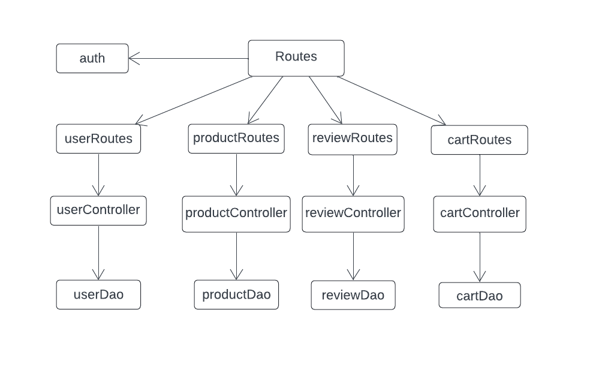
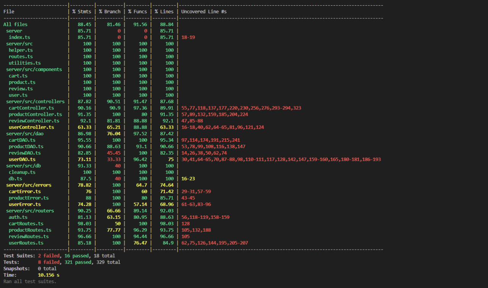

# Test Report

<The goal of this document is to explain how the application was tested, detailing how the test cases were defined and what they cover>

# Contents

- [Test Report](#test-report)
- [Contents](#contents)
- [Dependency graph](#dependency-graph)
- [Integration approach](#integration-approach)
- [Tests](#tests)
- [Coverage](#coverage)
  - [Coverage of FR](#coverage-of-fr)
  - [Coverage white box](#coverage-white-box)

# Dependency graph

     <report the here the dependency graph of EzElectronics>

  

# Integration approach

    <Write here the integration sequence you adopted, in general terms (top down, bottom up, mixed) and as sequence

    (ex: step1: unit A, step 2: unit A+B, step 3: unit A+B+C, etc)>

    <Some steps may  correspond to unit testing (ex step1 in ex above)>

    <One step will  correspond to API testing, or testing unit route.js>

### Testing on Cart API

In the process of testing the Cart API, we adopted the bottom-up approach. This approach involves starting the testing process from the individual units or the lowest level modules, and gradually moving up to the higher level modules.

In this case, the individual units we started with were the DAO functions, moving on to the controller and in the end to the routes. We performed unit testing on these modules, which involves testing each module separately to ensure that they function correctly in isolation.

We used both black box and white box testing methods, emulating the behavior of the modules and verifying the correctness of the output. We used mocks and stubs to isolate the modules from their dependencies and to simulate the behavior of the dependencies.

### Testing on Product API
For testing the Product API, we followed a bottom-up approach. We started by doing unit testing (both black box and white box) on the productDao, productController, and productRoute. This was possible with the use of mocks and stubs.

After unit testing, we did integration testing on the productRoute starting from the API endpoints that interact with the database without involving others methods, such as `getProducts` and `deleteAllProducts`. Then, we tested the API endpoints that interact with the database, such as `registerProducts`, `changeProductQuantity`, `sellProduct`, and `deleteProduct`. Finally, we tested the API endpoints that return data from the database, such as `getAvailableProducts`.

### Testing on User API
For testing the User API, we followed a similar bottom-up approach as with the other APIs. We started by doing unit testing on the userDao, userController, and userRoute. This involved testing each module separately to ensure their correct functionality in isolation.

After unit testing, we proceeded with integration testing on the userRoute. We tested the API endpoints that interact with the database, such as `createUser`, `getUsers`, `getUsersByRole`, `getUserByUsername`, `deleteUser`, `deleteAll`, `updateUserInfo`.

# Testing on Review API
Similar to the other APIs, we followed a bottom-up approach for testing the Review API. We started with unit testing on the reviewDao, reviewController, and reviewRoute. This involved testing each module separately to ensure their correct functionality in isolation.
After unit testing, we proceeded with integration testing on the reviewRoute. We tested the API endpoints that interact with the database, such as `addReview`, `getProductReviews`, `deleteReviewsOfProduct`, and `deleteReview`, `deleteAllReviews`, `deleteReview`.

# Tests

<in the table below list the test cases defined For each test report the object tested, the test level (API, integration, unit) and the technique used to define the test case (BB/ eq partitioning, BB/ boundary, WB/ statement coverage, etc)> <split the table if needed>

|                       Test case name                        |        Object(s) tested         | Test level |         Technique used         |
|:-----------------------------------------------------------:|:-------------------------------:|:----------:|:------------------------------:|
|           Products grouped by category Smartphone           |      Product (getProducts)      |    API     |  BB/ Equivalence Partitioning  |
|        Products grouped by model Samsung Galaxy S21         |      Product (getProducts)      |    API     |  BB/ Equivalence Partitioning  |
|                      Invalid category                       |      Product (getProducts)      |    API     |  BB/ Equivalence Partitioning  |
|                         Empty model                         |      Product (getProducts)      |    API     |          BB/ Boundary          |
|                      Invalid grouping                       |      Product (getProducts)      |    API     |          BB/ Boundary          |
|           Register product with all valid inputs            |   Product (registerProducts)    |    API     |  BB/ Equivalence Partitioning  |
|                     Future arrival date                     |   Product (registerProducts)    |    API     |          BB/ Boundary          |
|                   Duplicate product model                   |   Product (registerProducts)    |    API     |          BB/ Boundary          |
|   Register product with optional details and arrival date   |   Product (registerProducts)    |    API     |  BB/ Equivalence Partitioning  |
|                      Negative quantity                      |   Product (registerProducts)    |    API     |  BB/ Equivalence Partitioning  |
|                       With 0.01 price                       |   Product (registerProducts)    |    API     |          BB/ Boundary          |
|                     Zero selling price                      |   Product (registerProducts)    |    API     |          BB/ Boundary          |
|                      Invalid category                       |   Product (registerProducts)    |    API     |          BB/ Boundary          |
|                         Empty model                         |   Product (registerProducts)    |    API     |          BB/ Boundary          |
|         Increase product quantity with valid inputs         | Product (changeProductQuantity) |    API     |  BB/ Equivalence Partitioning  |
|                     Future change date                      | Product (changeProductQuantity) |    API     |          BB/ Boundary          |
|                 Non-existent product model                  | Product (changeProductQuantity) |    API     |          BB/ Boundary          |
|               Change date before arrival date               | Product (changeProductQuantity) |    API     |          BB/ Boundary          |
|     Increase product quantity with optional change date     | Product (changeProductQuantity) |    API     |  BB/ Equivalence Partitioning  |
|                      Negative quantity                      | Product (changeProductQuantity) |    API     |          BB/ Boundary          |
|                        Zero quantity                        | Product (changeProductQuantity) |    API     |          BB/ Boundary          |
|                         Empty model                         | Product (changeProductQuantity) |    API     |          BB/ Boundary          |
|           Sell product quantity with valid inputs           |      Product (sellProduct)      |    API     |  BB/ Equivalence Partitioning  |
|                     Future selling date                     |      Product (sellProduct)      |    API     |          BB/ Boundary          |
|                 Non-existent product model                  |      Product (sellProduct)      |    API     |          BB/ Boundary          |
|              Selling date before arrival date               |      Product (sellProduct)      |    API     |          BB/ Boundary          |
|      Sell product quantity with optional selling date       |      Product (sellProduct)      |    API     |  BB/ Equivalence Partitioning  |
|                      Negative quantity                      |      Product (sellProduct)      |    API     |  BB/ Equivalence Partitioning  |
|                        Zero quantity                        |      Product (sellProduct)      |    API     |  BB/ Equivalence Partitioning  |
|          Quantity greater than available quantity           |      Product (sellProduct)      |    API     |  BB/ Equivalence Partitioning  |
|                         Empty model                         |      Product (sellProduct)      |    API     |          BB/ Boundary          |
|                     Empty product stock                     |      Product (sellProduct)      |    API     |          BB/ Boundary          |
|               Retrieve all available products               | Product (getAvailableProducts)  |    API     |  BB/ Equivalence Partitioning  |
|                 Group products by category                  | Product (getAvailableProducts)  |    API     |  BB/ Equivalence Partitioning  |
|                   Group products by model                   | Product (getAvailableProducts)  |    API     |  BB/ Equivalence Partitioning  |
|                      Invalid grouping                       | Product (getAvailableProducts)  |    API     |  BB/ Equivalence Partitioning  |
|                      Invalid category                       | Product (getAvailableProducts)  |    API     |  BB/ Equivalence Partitioning  |
|                     Non-existent model                      | Product (getAvailableProducts)  |    API     |          BB/ Boundary          |
|                         Empty model                         | Product (getAvailableProducts)  |    API     |          BB/ Boundary          |
|                Delete all products as admin                 |   Product (deleteAllProducts)   |    API     |  BB/ Equivalence Partitioning  |
|               Delete all products as manager                |   Product (deleteAllProducts)   |    API     |  BB/ Equivalence Partitioning  |
|                 Unauthorized user deletion                  |   Product (deleteAllProducts)   |    API     |          BB/ Boundary          |
|                 Unauthorized role deletion                  |   Product (deleteAllProducts)   |    API     |  BB/ Equivalence Partitioning  |
|                  Delete a product as admin                  |     Product (deleteProduct)     |    API     |  BB/ Equivalence Partitioning  |
|                 Delete a product as manager                 |     Product (deleteProduct)     |    API     |  BB/ Equivalence Partitioning  |
|                 Unauthorized user deletion                  |     Product (deleteProduct)     |    API     |          BB/ Boundary          |
|                 Unauthorized role deletion                  |     Product (deleteProduct)     |    API     |  BB/ Equivalence Partitioning  |
|                Non-existent product deletion                |     Product (deleteProduct)     |    API     |          BB/ Boundary          |
|       Retrieve the unpaid empty cart of the customer        |         Cart (getCart)          |    API     |          BB/ Boundary          |
|   Retrieve the unpaid cart with products of the customer    |         Cart (getCart)          |    API     |  BB/ Equivalence Partitioning  |
|                  Wrong kind of user(Admin)                  |         Cart (getCart)          |    API     |  BB/ Equivalence Partitioning  |
|                 Wrong kind of user(Manager)                 |         Cart (getCart)          |    API     |  BB/ Equivalence Partitioning  |
|       Correct request of adding a product to the cart       |        Cart (addProduct)        |    API     |  BB/ Equivalence Partitioning  |
|                 Invalid request (no model)                  |        Cart (addProduct)        |    API     |          BB/ Boundary          |
|           Invalid request (model is not a string)           |        Cart (addProduct)        |    API     |          BB/ Boundary          |
|                 Wrong kind of user(Manager)                 |        Cart (addProduct)        |    API     |  BB/ Equivalence Partitioning  |
|                  Wrong kind of user(Admin)                  |        Cart (addProduct)        |    API     |  BB/ Equivalence Partitioning  |
|             Invalid request (product not found)             |        Cart (addProduct)        |    API     |          BB/ Boundary          |
|           Invalid request (product not available)           |        Cart (addProduct)        |    API     |          BB/ Boundary          |
|                Correct checkout of the cart                 |       Cart (checkoutCart)       |    API     |  BB/ Equivalence Partitioning  |
|          Invalid request of checkout (empty cart)           |       Cart (checkoutCart)       |    API     |  BB/ Equivalence Partitioning  |
| Invalid request of checkout (one product is not available)  |       Cart (checkoutCart)       |    API     |  BB/ Equivalence Partitioning  |
| Invalid request of checkout (request higher than the stock) |       Cart (checkoutCart)       |    API     |  BB/ Equivalence Partitioning  |
|                 Wrong kind of user(Manager)                 |       Cart (checkoutCart)       |    API     |  BB/ Equivalence Partitioning  |
|                  Wrong kind of user(Admin)                  |       Cart (checkoutCart)       |    API     |  BB/ Equivalence Partitioning  |
|                  Single cart history shown                  |     Cart (getCustomerCarts)     |    API     |  BB/ Equivalence Partitioning  |
|                    Multiple carts shown                     |     Cart (getCustomerCarts)     |    API     |  BB/ Equivalence Partitioning  |
|                 Wrong kind of user(Manager)                 |     Cart (getCustomerCarts)     |    API     |  BB/ Equivalence Partitioning  |
|                  Wrong kind of user(Admin)                  |     Cart (getCustomerCarts)     |    API     |  BB/ Equivalence Partitioning  |
|      Correctly removed a product from the current cart      |  Cart (removeProductFromCart)   |    API     |  BB/ Equivalence Partitioning  |
|            Invalid request (product not in cart)            |  Cart (removeProductFromCart)   |    API     |          BB/ Boundary          |
|               Invalid request (cart is empty)               |  Cart (removeProductFromCart)   |    API     |          BB/ Boundary          |
|                 Wrong kind of user(Manager)                 |  Cart (removeProductFromCart)   |    API     |  BB/ Equivalence Partitioning  |
|                  Wrong kind of user(Admin)                  |  Cart (removeProductFromCart)   |    API     |  BB/ Equivalence Partitioning  |
|                    Current cart cleared                     |        Cart (clearCart)         |    API     |  BB/ Equivalence Partitioning  |
|                 Wrong kind of user(Manager)                 |        Cart (clearCart)         |    API     |  BB/ Equivalence Partitioning  |
|                  Wrong kind of user(Admin)                  |        Cart (clearCart)         |    API     |  BB/ Equivalence Partitioning  |
|                  All carts deleted (Admin)                  |      Cart (deleteAllCarts)      |    API     |  BB/ Equivalence Partitioning  |
|                 All carts deleted (Manager)                 |      Cart (deleteAllCarts)      |    API     |  BB/ Equivalence Partitioning  |
|                Wrong kind of user (Customer)                |      Cart (deleteAllCarts)      |    API     |  BB/ Equivalence Partitioning  |
|                 All carts returned (Admin)                  |       Cart (getAllCarts)        |    API     |  BB/ Equivalence Partitioning  |
|                 All carts returned (Manager                 |       Cart (getAllCarts)        |    API     |  BB/ Equivalence Partitioning  |
|                Wrong kind of user (Customer)                |       Cart (getAllCarts)        |    API     | BB/ Equivalence Partitioning   |
| Create a new review (valid)                               | Review (createReview)         | API       | BB/ Equivalence Partitioning   |
| Create review with invalid score                          | Review (createReview)         | API       | BB/ Boundary                   |
| Create review for non-existent product                    | Review (createReview)         | API       | BB/ Boundary                   |
| Retrieve all reviews for a product                        | Review (getReviews)            | API       | BB/ Equivalence Partitioning   |
| Retrieve reviews for non-existent product                 | Review (getReviews)            | API       | BB/ Boundary                   |
| Delete a review for a product (valid)                     | Review (deleteReview)          | API       | BB/ Equivalence Partitioning   |
| Delete review for non-existent product                    | Review (deleteReview)          | API       | BB/ Boundary                   |
| Delete all reviews for a product (admin, valid)           | Review (deleteAllProductReviews)| API       | BB/ Equivalence Partitioning   |
| Delete all reviews for a non-existent product             | Review (deleteAllProductReviews)| API       | BB/ Boundary                   |
| Delete all reviews (admin)                                | Review (deleteAllReviews)      | API       | BB/ Equivalence Partitioning   |
| Add review (unit test, valid)                             | Review (addReview)             | Unit      | WB/ Statement Coverage         |
| Get product reviews (unit test, valid)                    | Review (getProductReviews)     | Unit      | WB/ Statement Coverage         |
| Delete review (unit test, valid)                          | Review (deleteReview)          | Unit      | WB/ Statement Coverage         |
| Delete reviews of product (unit test, valid)              | Review (deleteReviewsOfProduct) | Unit      | WB/ Statement Coverage         |
| Delete all reviews (unit test, valid)                     | Review (deleteAllReviews)       | Unit      | WB/ Statement Coverage         |
| Get user review (unit test, ReviewDAO)                    | Review (getUserReview)          | Unit      | WB/ Statement Coverage         |
| Add review (unit test, ReviewDAO)                         | Review (addReview)              | Unit      | WB/ Statement Coverage         |
| Get product reviews (unit test, ReviewDAO)                | Review (getProductReviews)      | Unit      | WB/ Statement Coverage         |
| Delete review (unit test, ReviewDAO)                      | Review (deleteReview)           | Unit      | WB/ Statement Coverage         |
| Delete reviews of product (unit test, ReviewDAO)          | Review (deleteReviewsOfProduct) | Unit      | WB/ Statement Coverage         |
| Delete all reviews (unit test, ReviewDAO)                 | Review (deleteAllReviews)       | Unit      | WB/ Statement Coverage         |
| Create user (unit test, valid)                            | User (createUser)               | Unit      | WB/ Statement Coverage         |
| Get user authentication status (unit test, valid)         | User (getIsUserAuthenticated)   | Unit      | WB/ Statement Coverage         |
| Get user by username (unit test)                          | User (getUserByUsername)        | Unit      | WB/ Statement Coverage         |
| Get all users (unit test)                                 | User (getUsers)                 | Unit      | WB/ Statement Coverage         |
| Get users by role (unit test)                             | User (getUsersByRole)           | Unit      | WB/ Statement Coverage         |
| Delete user (unit test, valid)                            | User (deleteUser)               | Unit      | WB/ Statement Coverage         |
| Delete all users (unit test)                              | User (deleteAll)                | Unit      | WB/ Statement Coverage         |
| Update user info (unit test)                              | User (updateUserInfo)           | Unit      | WB/ Statement Coverage         |
| Retrieve users by role (integration)                      | User (getUsersByRole)           | Integration | BB/ Equivalence Partitioning |
| Retrieve user by username for admin (integration)         | User (getUserByUsername)        | Integration | BB/ Equivalence Partitioning |
| Retrieve own user data (integration)                      | User (getCurrentUser)           | Integration | BB/ Equivalence Partitioning |
| Update user info (integration)                            | User (updateUserInfo)           | Integration | BB/ Equivalence Partitioning |
| Delete a user (integration)                               | User (deleteUser)               | Integration | BB/ Equivalence Partitioning |
| Delete all users as admin (integration)                   | User (deleteAllUsers)           | Integration | BB/ Equivalence Partitioning |
| Return 401 if not logged in (integration)                 | User (getCurrentUser)           | Integration | BB/ Boundary                   |
| Fail to delete all users as non-admin (integration)        | User (deleteAllUsers)           | Integration | BB/ Boundary                   |
| Return 404 if user does not exist (integration)           | User (getUserByUsername)        | Integration | BB/ Boundary                   |
| Create user (unit test, UserController, valid)            | User (createUser)               | Unit      | WB/ Statement Coverage         |
| Get users (unit test, UserController)                     | User (getUsers)                 | Unit      | WB/ Statement Coverage         |
| Get users by role (unit test, UserController)             | User (getUsersByRole)           | Unit      | WB/ Statement Coverage         |
| Get user by username (unit test, UserController)          | User (getUserByUsername)        | Unit      | WB/ Statement Coverage         |
| Delete user (unit test, UserController)                   | User (deleteUser)               | Unit      | WB/ Statement Coverage         |
| Delete all users (unit test, UserController)              | User (deleteAll)                | Unit      | WB/ Statement Coverage         |
| Update user info (unit test, UserController)              | User (updateUserInfo)           | Unit      | WB/ Statement Coverage         |
| Create a new user (integration, UserController)           | User (createUser)               | Integration | BB/ Equivalence Partitioning |
| Retrieve users by role (integration, UserController)      | User (getUsersByRole)           | Integration | BB/ Equivalence Partitioning |
| Retrieve user by username (integration, UserController)   | User (getUserByUsername)        | Integration | BB/ Equivalence Partitioning |
| Update user info (integration, UserController)            | User (updateUserInfo)           | Integration | BB/ Equivalence Partitioning |
| Delete a user (integration, UserController)               | User (deleteUser)               | Integration | BB/ Equivalence Partitioning |
| Handle non-existent user (integration, UserController)    | User (deleteUser)               | Integration | BB/ Boundary                   |
| Create a new review (integration, review routes)          | Review (addReview)              | Integration | BB/ Equivalence Partitioning |
| Return 422 for invalid score (integration, review routes) | Review (addReview)              | Integration | BB/ Boundary                   |
| Return 404 for non-existent product (integration, review routes) | Review (addReview)         | Integration | BB/ Boundary                   |
| Retrieve all reviews for a product (integration, review routes) | Review (getProductReviews) | Integration | BB/ Equivalence Partitioning |
| Return 404 for non-existent product reviews (integration, review routes) | Review (getProductReviews) | Integration | BB/ Boundary                   |
| Delete a review for a product (integration, review routes) | Review (deleteReview)          | Integration | BB/ Equivalence Partitioning |
| Return 404 for non-existent product review (integration, review routes) | Review (deleteReview)    | Integration | BB/ Boundary                   |
| Delete all reviews for a product (integration, review routes) | Review (deleteReviewsOfProduct) | Integration | BB/ Equivalence Partitioning |
| Return 404 for non-existent product (integration, review routes) | Review (deleteReviewsOfProduct) | Integration | BB/ Boundary                   |
| Delete all reviews (integration, review routes)           | Review (deleteAllReviews)       | Integration | BB/ Equivalence Partitioning |

# Coverage

## Coverage of FR

<Report in the following table the coverage of functional requirements and scenarios(from official requirements) >

|                   Functional Requirement or scenario                    |                                                                                                                                                                                                                                                                                                                                                       Test(s)                                                                                                                                                                                                                                                                                                                                                       |
|:-----------------------------------------------------------------------:|:-------------------------------------------------------------------------------------------------------------------------------------------------------------------------------------------------------------------------------------------------------------------------------------------------------------------------------------------------------------------------------------------------------------------------------------------------------------------------------------------------------------------------------------------------------------------------------------------------------------------------------------------------------------------------------------------------------------------:|
|                  FR3.1  Register a set of new products                  |                                   `test("Should register a new product as admin")`, `test("Should register a new product as manager")`, `test("Should fail to register a new product as customer")`, `test("Should return 409 if the product model already exists")`, `test("Should return 400 if arrival date is after the current date")`, `test("should register a product with optional details and arrival date")`, `test("should return 422 for negative quantity")`, `test("should return 200 for 0.01 selling price")`, `test("should return 422 for zero selling price")`, `test("should return 422 for invalid category")`, `test("should return 422 for empty model")`                                   | 
|                 FR3.2  Update the quantity of a product                 |                                                                 `test("Should increase product quantity for admin")`, `test("Should increase product quantity for manager")`, `test("Should fail to increase the product quantity as customer")`, `test("Should return 404 for non-existent product model")`, `test("Should return 400 if changeDate is after the current date")`, `test("Should return 400 if changeDate is before the product's arrival date")`, `test("should increase product quantity with optional change date")`, `test("Should return 422 if quantity is not greater than 0")`, `test("should return 404 for empty model")`                                                                 |
|                          FR3.3  Sell a product                          | `test("Should reduce product quantity after sale for admin")`, `test("Should reduce product quantity after sale for manager")`, `test("Should fail to record a sale as customer")`, `test("Should return 404 for non-existent product model")`, `test("Should return 400 if sellingDate is after the current date")`, `test("Should return 400 if sellingDate is before the product's arrival date")`, `test("Should return 409 if product quantity is 0")`, `test("Should return 409 if product quantity is lower than requested")`, `test("Should return 422 if quantity is not greater than 0")`, `test("should return 404 for empty model")`, `test("should sell product quantity with optional selling date")` |
|                  FR3.4  Show the list of all products                   |                                                                                                                                                                                                                                                                             `test("Should return all products for admin")`, `test("Should return all products for manager")`, `test("Should fail to return all products for customer")`                                                                                                                                                                                                                                                                             |
|            FR3.4.1  Show the list of all available products             |                                                                                                                                                                                                                       `test("Should return all available products for admin")`, `test("Should return all available products for manager")`, `test("Should return all available products for a logged-in user")`, `test("Should fail to return available products for a non-logged-in user")`                                                                                                                                                                                                                        |
|       FR3.5  Show the list of all products with the same category       |                                                                                                                                                                                                                                                         `test("Should return products grouped by category Smartphone")`, `test("Should return products grouped by category Laptop")`, `test("Should fail to return all products with invalid parameters")`                                                                                                                                                                                                                                                          |
| FR3.5.1  Show the list of all available products with the same category |                                                                                                                                                                                                                                      `test("Should return all available products grouped by category Smartphone")`, `test("Should return all available products grouped by category Laptop")`, `test("Should fail to return all available products with invalid parameters")`                                                                                                                                                                                                                                       |
|        FR3.6  Show the list of all products with the same model         |                                                                                                                                                                                                                                                      `test("Should return product with model Huawei Matebook")`, `test("Should fail to return all products with invalid parameters")`, `test("should return 404 for product with model that does not exist")`                                                                                                                                                                                                                                                       |
|  FR3.6.1  Show the list of all available products with the same model   |                                                                                                                                                                                                                                                                                                  `test("Should return available products filtered by model")`, `test("Should return 404 if model does not exist")`                                                                                                                                                                                                                                                                                                  |
|                         FR3.7  Delete a product                         |                                                                                                                                                                                                                               `test("Should delete a product for admin")`, `test("Should delete a product for manager")`, `test("Should return 404 if product does not exist")`, `test("Should fail to delete a product for customer")`, `test("should return 401 if not logged in")`                                                                                                                                                                                                                               |
|                       FR3.8  Delete all products                        |                                                                                                                                                                                                                                                      `test("Should delete all products for admin")`, `test("Should delete all products for manager")`, `test("should return 401 if not logged in")`, `test("Should fail to delete all products for customer")`                                                                                                                                                                                                                                                      |
|             FR5.1 Show the information of the current cart              |                `test('Should return a cart when getCart is called')`, `test('Should return a cart with products when getCart is called')`                |                                                                                       |       
|                 FR5.2 Add a product to the current cart                 |                                                        `test('Should add a product to the cart')`                                                        |
|                     FR5.3 Checkout the current cart                     |                                                            `test('Should checkout the cart')`                                                            |
|                FR5.4 Show the history of the paid carts                 |                                 `test('Should return the cart history')`, `test('Should return moltiple cart history')`                                  |
|              FR5.5 Remove a product from the current cart               |                                                     `test('Should remove a product from the cart')`                                                      |
|                      FR5.6 Delete the current cart                      |                                                             `test('Should clear the cart')`                                                              |
|              FR5.7 See the list of all carts of all users               |                               `test('Should clear the carts as an admin')`, `test('Should clear the carts as a manager')`                                |
|                         FR5.8 Delete all carts                          |                          `test('Should return all the carts as an admin')`, `test('Should return all the carts as a manager ')`                          |
|FR4.0 Register a new account	|`test("It should resolve true")`, `test("It should return true")`, `test('should create a new user')`|
|FR4.1 Authenticate a user	|`test("It should resolve true")`, `test('should retrieve own user data')`|
|FR4.2 Logout user	|`test("It should resolve true")`, `test('should logout user')`|
|FR4.3 Authorize a user to perform a specific action	|`test("should fail to perform an action without authorization")`, `test('should perform an action with proper authorization')`|
|FR5.1 Review products in order	|`test("should create a new review")`, `test("should return 422 for invalid score")`, `test("should return 404 for non-existent product")`, `test("should retrieve all reviews for a product")`, `test("should return 404 for non-existent product reviews")`, `test("should delete a review for a product")`, `test("should return 404 for non-existent product review")`, `test("should delete all reviews for a product")`, `test("should return 404 for non-existent product")`, `test("should delete all reviews")`|
## Coverage white box

 
